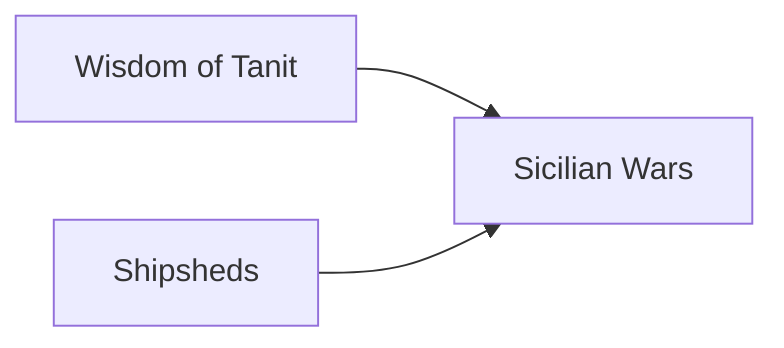

---
aliases:
tags:
  - Civilization
  - Antiquity
  - DLC
---
*Available with the Carthage Pack DLC*
*Included in the [[Crossroads of the World Collection]]*

  

[[Militaristic]], [[Economic]]

>*From the shelter of the cothon, ships prepare for their expeditions. Some are loaded with fine pottery, grain, and other goods to be exchanged for gold and ivory. Others carry soldiers ready to profit by other means. Each will return home, to the center of the world – Carthage. Open the cothon gates, and let returning fleets shower the city in prosperity.*

## Unique Ability
##### *Phoenician Heritage*
- Can only have 1 City; Towns can purchase Water Buildings with any Town Focus, but cannot use Convert to City
- Receive a second Merchant or Colonist/Settler each time you purchase or train one

## Unique Infrastructure
##### Quarter: *Punic Port*
- +2 Resource Capacity in this Settlement
- Receive an addition +3 Capacity when placed in the Capital
- Building: **Cothon**
	- +2 Production
	- +1 Production adjacency for Coast, Navigable Rivers, and Wonders
	- Must be placed on Coast
- Building: **Dockyard**
	- +2 Gold
	- +1 Food adjacency for Resources, Districts, and Wonders
	- Must be placed on Coast

## Unique Units
##### Cavalry Unit: *Numidian Cavalry*
- Can only be purchased and are more expensive
- +1 Combat Strength for each unique City Resource assigned to your Capital
##### Settler: *Colonist*
- +1 Embarked Movement and +1 Population if Settled adjacent to a Resource

## Civics – Antiquity
##### *Wisdom of Tanit*
- Building: **Dockyard**
- Tradition: **Gaulos I**
	- +25% Gold towards purchasing Naval Units and Water Buildings
	- +1 Gold in the Capital for every Town
##### *Shipsheds*
- Building: **Cothon**
- Wonder: **Byrsa**
- Tradition: **Quinquereme I**
	- +1 Range for Heavy Naval Units
	- -1 Gold Maintenance for Naval Units
##### *Sicilian Wars*
- Tradition: **Suffetes**
	- +20% Gold in Mining Towns
	- +20% Food in Fishing or Farming Towns
	- +1 Naval Trade Route Range for every Town with a Trade Outpost Focus
- +2 Settlement Limit
- +1 Tradition slot

## Civics – Exploration
##### *Renaissance*
- Tradition: **Quinquereme II**
	- +1 Range for Heavy Naval Units
	- -2 Gold Maintenance for Naval Units
	- +1 Combat Strength for Naval Units for each Unique City Resource assigned to your Capital
- +1 Settlement Limit
- +1 Tradition slot
##### *Hierarchy*
- Attribute Traditions: [[Economic|Supply and Demand]] and [[Militaristic|Professional Army]]
- +1 Settlement Limit
##### *Syncretism*
- Affirmation Tradition: **Hannoid Rule I**
	- +1 Gold and Production in the Capital for every Resource assigned to it

## Civics – Modern
##### *Modernization*
- Tradition: **Gaulos II**
	- +25% Gold towards purchasing Naval Units and Water Buildings
	- +3 Gold in the Capital for every Town
- +1 Settlement Limit
- +1 Tradition slot
##### *Administration*
- Attribute Traditions: [[Economic|Gold Standard]] and [[Militaristic|Force Structuring]]
- +1 Settlement Limit
##### *Syncretism*
- Affirmation Tradition: **Hannoid Rule II**
	- +2 Gold and Production in the Capital for every Resource assigned to it

## Associated Wonder
##### *Byrsa*
- +2 Gold
- Trade Routes cannot be plundered
- All Districts in this City that are adjacent to Coast and eligible for Walls receive a Wall
- Must be placed adjacent to a Coast tile

## Starting Biases
- Coast
- Grassland

>*The children of Tyre come from afar to claim their destiny. From the center of the world, they will command an empire that knows no equal.*
