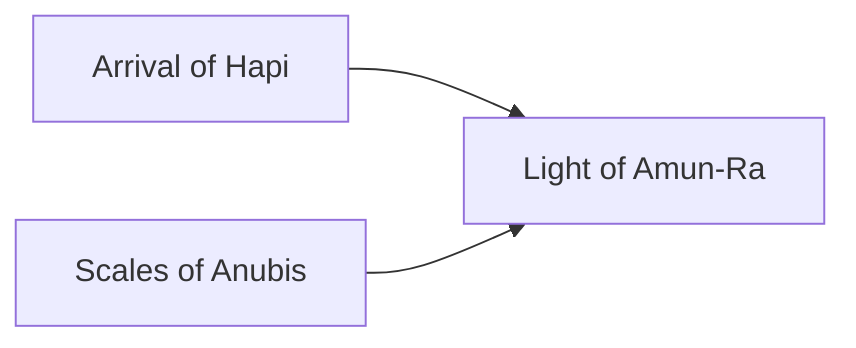

---
aliases:
tags:
  - Civilization
  - Antiquity
  - Vanilla
---

[[Cultural]], [[Economic]]

>*From the river-fed fields of grain to the polished limestone obelisks rises Egypt. Nurtured by the black soil that graces its riverbanks, Egypt provides for its people. And in its limestone obelisks and tombs, it challenges the most implacable of foes—time itself. Take up now the sharpened khopesh or the bronze chisel and make your mark – immortality awaits.*

## Unique Ability
##### *Gifts of Osiris*
- +2 Production on Improvements and Districts on Navigable Rivers
- Minor Rivers do not end Unit Movement
- [Mod] +1 Tourism from Wonders

## Unique Infrastructure
##### Quarter: *Necropolis*
- Grants 100 Gold (on Standard Speed) when any Wonder is completed in this Settlement
- Building: **Mastaba**
	- +3 Culture
	- +1 Gold Adjacency for Desert Terrain, Navigable Rivers, and Wonders
- Building: **Mortuary Temple**
	- +3 Gold
	- +1 Happiness Adjacency for Navigable Rivers
	- +1 Culture Adjacency for Wonders

## Unique Units
##### Infantry Unit: *Medjay*
- Has no Maintenance
- +3 Combat Strength in friendly territory, doubled when stationed in a Settlement you own
##### Great Person: *Tjaty*
- Can only be trained in Cities with a Necropolis
- **Amhose**: Activate on the Palace to add +3 Culture to the Building
- **Aperel**: Activate in friendly territory to create 2 Cavalry Units with +3 Combat Strength
- **Hemiunu**: Activate on a Wonder under construction to add 200 Production (on Standard Speed)
- **Imhotep**: Activate on a Wonder under construction to add 250 Production (on Standard Speed)
- **Khay**: Active in friendly territory to create 2 Medjay with +3 Combat Strength
- **Nebet**: Activate on a Necropolis to immediately start a Celebration
- **Paser**: Activate on a Wonder under construction to add 150 Production (on Standard Speed)
- **Ptahhotep**: Activate on a Building or Wonder with a Great Work Slot to grant a Codex called *The Maxims of Ptahhotep* that grants +3 Science
- **Ramose**: Activate on a Wonder to add +2 Gold to all Wonders currently in this Settlement
- **Useramen**: Activate on a Wonder to add +2 Culture to all Wonders currently in this Settlement

## Civics – Antiquity
##### *Arrival of Hapi*
- Building: **Mortuary Temple**
- Tradition: **Akhet I**
	- +2 Food on Improvements and Districts on Navigable Rivers
##### *Scales of Anubis*
- Building: **Mastaba**
- Medjay generate +1 Gold when stationed in a Settlement you own
- Tradition: **Riches of the Duat**
	- +10% Production towards constructing Wonders, doubled when constructed in Cities with City Centers in Desert Terrain
	- +2 Production on Wonders on Desert
##### *Light of Amun-Ra*
- Tradition: **Kemet I**
	- +2 Culture on Improvements and Districts on Navigable Rivers
- Wonder: **Pyramids**
- +1 Tradition slot
- +1 Settlement Limit

## Civics – Exploration
##### *Renaissance*
- Tradition: **Akhet II**
	- +3 Food on Improvements and Districts on Navigable Rivers
- +1 Settlement Limit
- +1 Tradition slot
##### *Hierarchy*
- Attribute Traditions: [[Cultural|Classical Revival]] and [[Economic|Supply and Demand]]
- Wonder: **Notre Dame**
##### *Syncretism*
- Affirmation Tradition: **Golden Horus I**
	- +1 Culture and Gold on Wonders, doubled on Antiquity Wonders

## Civics – Modern
##### *Modernization*
- Tradition: **Kemet II**
	- +3 Culture on Improvements and Districts on Navigable Rivers
- +1 Settlement Limit
- +1 Tradition slot
##### *Administration*
- Attribute Traditions: [[Cultural|Romanticism]] and [[Economic|Gold Standard]]
- Wonder: **Taj Mahal**
##### *Syncretism*
- Affirmation Tradition: **Golden Horus II**
	- +2 Culture and Gold on Wonders, doubled on Antiquity Wonders

## Associated Wonder
##### *Pyramids*
- Unlocked for any Civilization by the *Masonry* Technology
- +1 Gold and Production on Improvements and Districts on Minor River and Navigable River tiles in this Settlement
- Must be placed adjacent to a Navigable River not in Tundra

## Starting Biases
- Navigable Rivers
- Desert

.png/revision/latest)

>*The waters flood again, preparing the lands for new growth. Here Egypt will compel the world to behold the wonders it works.*

