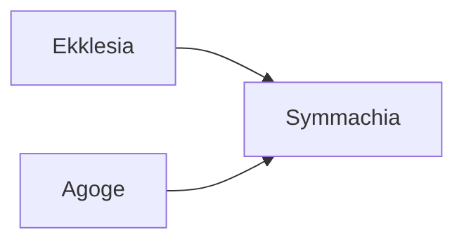

---
aliases:
tags:
  - Civilization
  - Antiquity
  - Vanilla
---

[[Cultural]], [[Diplomatic]]

>*Out of many sources—militaristic Sparta, erudite Athens, wealthy Corinth—comes the rich bounty of Greece. Wielding poetry sharper than a hoplite's spear, the writers and thinkers of Greece describe the beauty and nature of the world, even as the phalanx begins its march. Guide them in their quest for glory and fame.*

## Unique Ability
##### *Demokratia*
- +3/+4/+5 Influence on the Palace
- +2/+2/+3 Culture for active Endeavors, Sanctions, and Diplomatic Projects you started or supported
- [Exp/Mod] +2/+3 Culture for active Espionage Actions you started or supported
- +3 Tourism for every City-State you are Suzerain of

## Unique Infrastructure
##### Quarter: *Acropolis*
- +2 Gold on the Parthenon for each City-State you are Suzerain of
- Building: **Odeon**
	- +3 Happiness
	- +1 Culture Adjacency for Quarters and Wonders
- Building: **Parthenon**
	- +3 Culture
	- +2 Influence if placed on Rough Terrain
	- +1 Culture Adjacency for Wonders

## Unique Units
##### Infantry Unit: *Hoplite*
- +2 Combat Strength if adjacent to another Hoplite
##### Great Person: *Logios*
- Can only be trained in Cities with an Acropolis
- **Arete of Cyrene**: Activate on an Acropolis to grant 75 Influence (on Standard Speed)
- **Aristotle**: Activated on an Academy to add +4 Culture to the Building
- **Aspasia**: Activate on a Library to add +3 Happiness to the Building
- **Hypatia**: Activate on a Library to add +3 Science to the Building
- **Plato**: Activate on an Acropolis to give this City Culture per turn equal to 50% of its Influence yield
- **Pythagoras**: Activate on an Acropolis to immediately trigger a Celebration
- **Sappho**: Activate on a tile with a Constructible with an open Great Work Slot to create *Hymn to Aphrodite* (+2 Culture)
- **Socrates**: Activate on a Palace or City Hall to add +2 Influence to the Building
- **Thales of Miletus**: Activate on an Acropolis to give this City Science per turn equal to 50% of its Influence yield
- **Xenophon**: Activate on an Acropolis to create 2 Hoplites with +3 Combat Strength

## Civics – Antiquity
##### *Ekklesia*
- Building: **Odeon**
- Tradition: **Xenia I**
	- +50% Influence toward initiating and progressing the Befriend Independent Project
##### *Agoge*
- Building: **Parthenon**
- Tradition: **Strategoi**
	- +1 Combat Strength for Infantry Units for each City-State you are Suzerain of
##### *Symmachia*
- Tradition: **Delian League I**
	- +30% Influence towards initiating Endeavors
- Tradition: **Peloponnesian League I**
	- +30% Influence towards initiating Sanctions
- Mastery
	- +1 Settlement Limit
	- +1 Tradition slot
	- Wonder: **Oracle**

## Civics – Exploration
##### *Renaissance*
- Tradition: **Delian League II**
	- +50% Influence towards initiating and supporting Endeavors
- Tradition: **Peloponnesian League II**
	- +50% Influence towards initiating Sanctions and Espionage Actions
- +1 Settlement Limit
- +1 Tradition slot
##### *Hierarchy*
- Attribute Traditions: [[Cultural|Classical Revival]] and [[Diplomatic|Spy Network]]
- Wonder: **Notre Dame**
##### *Syncretism*
- Affirmation Tradition: **Hellenism I**
	- +1 Happiness and Production in Cities for each City-State you are Suzerain of

## Civics – Modern
##### *Modernization*
- Tradition: **Xenia II**
	- +50% Influence toward initiating and progressing the Befriend Independent Project
	- +4 Culture for each City-State you are Suzerain of
- +1 Settlement Limit
- +1 Tradition slot
##### *Administration*
- Attribute Traditions: [[Cultural|Romanticism]] and [[Diplomatic|The Great Game]]
- Wonder: **Taj Mahal**
##### *Syncretism*
- Affirmation Tradition: **Hellenism II**
	- +2 Happiness and Production in Cities for each City-State you are Suzerain of

## Associated Wonder
##### *Oracle*
- Unlocked for any Civilization by the *Public Life* Civic
- +2 Culture
- When gaining rewards from a Narrative Event, gain an additional 20 Culture per Age
- +1 Wildcard Attribute Point
- Must be placed on Rough Terrain

## Age Unlocks
*(available for and grants access to the below for Syncretism and Age Transition)*
- Exploration
	- [[Bulgaria]]
	- [[Norman]]
	- [[Spain]]
- Modern
	- [[Russia]]
- Leaders
	- [[Ada Lovelace]]
	- [[Alexander the Great]]
	- [[Benjamin Franklin]]
	- [[Catherine the Great]]
	- [[Charlemagne]]
	- [[Isabella]]
	- [[Lafayette]]
	- [[Machiavelli]]

## Starting Biases
- Rough
- Grassland

.png/revision/latest)

>*The people gather together, debating music and politics, poetry and law—envisioning how to build a Greece that will last for ages.*

