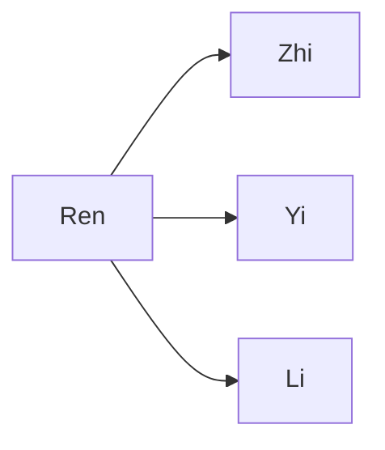

---
tags:
  - Civilization
  - Antiquity
  - Vanilla
---

[[Diplomatic]], [[Scientific]]

>*Forged from the legacies of the militaristic Qin and the cultured Zhou, the Han Dynasty of China rules with righteousness tempered with benevolence, with wisdom informed by tradition. Han engineers transformed the land, even as Han philosophers transformed the mind. Go now, and take up the Mandate of Heaven.*

## Unique Ability
##### *Nine Provinces*
- The Capital/Cities/All Settlements gain a Population when they complete Science Buildings
- [Ant] The Capital gains an additional Population with its first growth event
- New Towns gain an additional Population with their first growth event

## Unique Infrastructure
##### Improvement: *Great Wall*
- +2 Culture
- +1 Happiness for adjacent Great Wall segments
- +1 Tourism
- Counts as a Fortification, +6 Combat Strength when defending
- A Road is also placed with each Great Wall Segment
- Can only be built in a line
- Cannot branch or fork
- Has reduced cost scaling compared to other Unique Improvements

## Unique Units
##### Ranged Unit: *Chu-Ko-Nu*
- Has Zone of Control and a higher Defense Strength
- +5 Combat Strength when attacking adjacent Units
##### Great Person: *Shì Dàfū*
- Can only be trained in the Capital with at least 10 Population
- **Ban Zhao**: Activate on a Building or Wonder with a Great Work Slot to grant a Codex called *Book of Han* that grants +2 Culture
- **Han Fei**: Activate on the Palace to add +3 Science to the Building
- **Laozi**: Activate on a Constructible with a Great Work Slot to grant a Codex called *Tao Te Ching* that grants +2 Happiness
- **Mencius**: Activate on a Science Building to receive a free random Technology
- **Mozi**: Activated in the Capital to immediately add Population
- **Shang Yang**: Activated on the Palace to add +3 Influence to it
- **Shen Buhai**: Activate in the Capital to immediately trigger a Celebration
- **Huo Qubing**: Activate on an Army Commander to grant it 1 Promotion
- **Xun Kuang**: Activate in a City to add +1 Science to all Codices in that City
- **Zhang Heng**: Activate on an Academy to grant +4 Science to the Building

## Civics – Antiquity
## Civic Tree
##### *Ren*
- Tradition: **Xumin Zhao**
	- +2 Food on Happiness Buildings
	- +1 Influence for every Tradition slotted in the Government
- +1 Tradition slot
##### *Zhi*
- Tradition: **Xiu Taixue**
	- Science Buildings gain a +1 Science Adjacency for Quarters
- Tradition: **Ju Xian I**
	- +1 Science from Specialists
##### *Yi*
- Improvement: **Great Wall**
- Tradition: **Fenghuo I**
	- +1 Movement and +3 Combat Strength for Units on Fortification Buildings and Improvements in your Territory
	- +2 Gold on Fortification Buildings and Improvements
##### *Li*
- Wonder: **Weiyang Palace**
- +1 Settlement Limit

## Civics – Exploration
##### *Renaissance*
- Tradition: **Fenghuo II**
	- +1 Movement and +5 Combat Strength for Units on Fortification Buildings and Improvements in your Territory
	- +3 Gold on Fortification Buildings and Improvements
- +1 Settlement Limit
- +1 Tradition slot
##### *Hierarchy*
- Attribute Traditions: [[Diplomatic|Jubilee]] and [[Scientific|Alchemy]]
##### *Syncretism*
- Affirmation Tradition: **Capable Rule I**
	- +1 Science in Cities for every Tradition slotted in the Government

## Civics – Modern
##### *Modernization*
- Tradition: **Ju Xian II**
	- +1 Science from Specialists
	- +10% Science in the Capital
- +1 Settlement Limit
- +1 Tradition slot
##### *Administration*
- Attribute Traditions: [[Diplomatic|Vaudeville]] and [[Scientific|Location Theory]]
##### *Syncretism*
- Affirmation Tradition: **Capable Rule I**
	- +2 Science in Cities for every Tradition slotted in the Government

## Associated Wonder
##### *Weiyang Palace*
- Unlocked for any Civilization by the *Citizenship II* Civic
- +3 Influence
- +1 Tradition slot
- Must be placed on Grassland

## Age Unlocks
*(available for and grants access to the below for Syncretism and Age Transition)*
- Exploration
	- [[Ming]]
	- [[Mongolia]]
- Modern
	- [[Qing]]
- Leaders
	- [[Confucius]]

## Starting Bias
- Grassland

.png/revision/latest)

>*Harmony reveals itself through the shaping of energy, the cultivation of order. Now, the Han shall be its ministers.*

