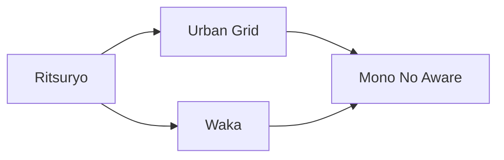

---
tags:
  - Antiquity
  - Civilization
  - DLC
---
*Available with the Heian Pack DLC*
*Included in the [[Brush and Blade Collection]]*
  

[[Cultural]], [[Diplomatic]]

>*The court of Heian Japan is best seen by the light of the clouded moon. Its poets write of love and the seasons, sorry and the beauty of court life. Take up the poet's brush, and write in praise of shadow.*

## Unique Ability
##### *Pure Land*
- +2/+3/+3 Culture on Improvements on Breathtaking tiles
- [Mod] Cities receive 2 Tourism for each Improvement and District on Breathtaking tiles when at least 7 tiles are Breathtaking

## Unique Infrastructure
##### Improvement: *Jinja*
- +2 Happiness
- +2 Culture Adjacency for Charming and Breathtaking tiles
- One Jinja (Land) and one Jinja (Sea) per Settlement

## Unique Units
##### Ranged Unit: *Yumi*
- +2 Movement
- +5 Combat Strength if this Unit has not moved this turn
##### Great Person: *Shijin*
- Can only be trained in settlements with a Jinja
- **Izumi Shikibu**: Activate on an Altar to add increased Culture to the Building.
- **Ki no Tomonori**: Activate on the Palace to add increased Happiness to the Building.
- **Ki no Tsurayuki**: Activate on a Great Work Building to grant an additional Great Work slot to all Buildings in this Settlement with a Great Work slot.
- **Lady Sarashina**: Activate on a Great Work Building; receive increased culture to this Building for each slotted Great Work.
- **Mibu no Tadamine**: Activate on a Culture Building in a City. Its Specialists grant increased Culture.
- **Michitsuna's Mother**: Activate on a Jinja to add increased Happiness to all Jinja in this Settlement.
- **Murasaki Shikibu**: Activate on a Constructible with a Great Work Slot to receive *The Tale of Genji*, which grants increased Culture.
- **Nakayama Tadachika**: Activate on the Palace to add increased Influence to the Building.
- **Oshikochi no Mitsune**: Activate on a Culture Building to grant increased Culture to all Culture Buildings in this Settlement.
- **Sei Shonagon**: Activate on a Constructible with a Great Work Slot to receive *The Pillow Book*, which grants increased Happiness.

## Civics – Antiquity
##### *Ritsuryo*
- Improvement: **Jinja**
- +1 Tradition slot
- Tradition: **Insei I**
	- +2 Happiness on Culture Buildings when not in a Celebration
	- +2 Culture on Happiness Buildings when in a Celebration
##### *Urban Grid*
- Wonder: **Hoo-do Hall**
- Tradition: **Jo-bo System I**
	- All buildings receive a +0.5 Culture Adjacency for Breathtaking tiles
##### *Waka*
- Gain 1 Codex
- Tradition: **Utsurou**
	- Settlements with an Army Commander Stationed receive +2 Culture for each Great Work on display, but Commanders receive -25% XP
##### *Mono No Aware*
- +1 Tradition slot
- Tradition: **Mongatari**
	- Great Work Buildings and Wonders receive a +1 Happiness Adjacency with Charming tiles and a +2 Food Adjacency with Breathtaking tiles

## Civics – Exploration
##### *Renaissance*
- Tradition: **Jo-bo System II**
	- All buildings receive a +1 Culture Adjacency for Breathtaking tiles
- +1 Tradition slot
##### *Hierarchy*
- Attribute Traditions: [[Cultural|Classical Revival]] and [[Diplomatic|Jubilee]]
- Wonder: **Notre Dame**
##### *Syncretism*
- Affirmation Tradition: **Shikken I**
	- +1 Culture on Improvements and Districts on Breathtaking Tiles

## Civics – Modern
##### *Modernization*
- Tradition: **Insei II**
	- +4 Happiness on Culture Buildings when not in a Celebration
	- +4 Culture on Happiness Buildings when in a Celebration
- +1 Tradition slot
##### *Administration*
- Attribute Traditions: [[Cultural|Romanticism]] and [[Diplomatic|Vaudeville]]
- Wonder: **Taj Mahal**
##### *Syncretism*
- Affirmation Tradition: **Shikken II**
	- +2 Culture on Improvements and Districts on Breathtaking Tiles

## Associated Wonder
##### *Hoo-do Hall*
- Unlocked for any Civilization by the *Code of Laws II* Civic
- Wonders provide +1 Appeal to adjacent tiles
- Breathtaking tiles receive +1 Production, +1 Culture, and +1 Happiness in this Settlement
- Must be placed on Flat Terrain adjacent to a River

## Starting Biases
- Mountains
- Rivers
- Vegetated

