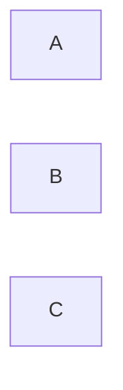

---
tags:
  - Antiquity
  - Civilization
  - DLC
  - Unreleased
---
*Available with the Heian Pack DLC*
*Included in the [[Brush and Blade Collection]]*
  
  

[[]], [[]]

>**

## Unique Ability
##### *Pure Land*
- Increased Culture on Improvements on Breathtaking tiles
- [Mod] Cities receive a set amount of Tourism per Breathtaking tile once they contain a minimum number of them

## Unique Infrastructure
##### Infrastructure: **
- 

## Unique Units
##### Unit: **
- 
##### Unit: **
- 

## Civics – Antiquity
##### **
- 
- 
- 
##### **
- 
- 
- 
##### **
- 
- 
- 

## Civics – Exploration
##### *Renaissance*
- Tradition: ****
	- 
- 
##### *Hierarchy*
- Attribute Traditions: 
- 
##### *Syncretism*
- Affirmation Tradition: ****
	- 

## Civics – Modern
##### *Modernization*
- Tradition: ****
	- 
- 
##### *Administration*
- Attribute Traditions: 
- 
##### *Syncretism*
- Affirmation Tradition: ****
	- 

## Associated Wonder
##### **
- 
- 
- 

## Starting Biases
- 
- 

