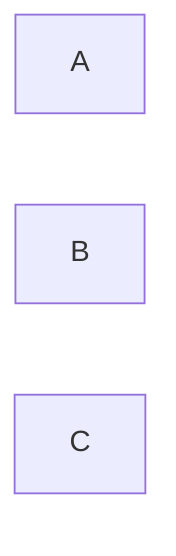

---
tags:
  - Antiquity
  - Civilization
  - DLC
  - Unreleased
---
*Available with the Heian Pack DLC*
*Included in the [[Brush and Blade Collection]]*
  

[[Cultural]], [[Diplomatic]]

>**

## Unique Ability
##### *Pure Land*
- Increased Culture on Improvements on Breathtaking tiles
- [Mod] Cities receive a set amount of Tourism per Breathtaking tile once they contain a minimum number of them

## Unique Infrastructure
##### Improvement: *Jinja*
- Increased Happiness
- Culture Adjacency for Charming and Breathtaking tiles
- Can be placed on land, or on Water if adjacent to flat terrain
- Can only have a set amount per settlement

## Unique Units
##### Ranged Unit: *Yumi*
- Increased Movement
- Increased Combat Strength if this Unit has not moved this turn
##### Great Person: *Shijin*
- Can only be trained in settlements with a Jinja
- **Izumi Shikibu**: Activate on an Altar to add increased Culture to the Building.
- **Ki no Tomonori**: Activate on the Palace to add increased Happiness to the Building.
- **Ki no Tsurayuki**: Activate on a Great Work Building to grant an additional Great Work slot to all Buildings in this Settlement with a Great Work slot.
- **Lady Sarashina**: Activate on a Great Work Building; receive increased culture to this Building for each slotted Great Work.
- **Mibu no Tadamine**: Activate on a Culture Building in a City. Its Specialists grant increased Culture.
- **Michitsuna's Mother**: Activate on a Jinja to add increased Happiness to all Jinja in this Settlement.
- **Murasaki Shikibu**: Activate on a Constructible with a Great Work Slot to receive *The Tale of Genji*, which grants increased Culture.
- **Nakayama Tadachika**: Activate on the Palace to add increased Influence to the Building.
- **Oshikochi no Mitsune**: Activate on a Culture Building to grant increased Culture to all Culture Buildings in this Settlement.
- **Sei Shonagon**: Activate on a Constructible with a Great Work Slot to receive *The Pillow Book*, which grants increased Happiness.

## Civics – Antiquity
##### **
- Tradition: **Insei I**
	- Increased Happiness on Culture Buildings when not in a Celebration
	- Increased Culture on Happiness Buildings when in a Celebration
##### **
- Tradition: **Jo-bo System I**
	- All buildings receive a Culture Adjacency with Breathtaking tiles
##### **
- Tradition: **Mongatari**
	- Great Work Constructibles receive increased Happiness on Charming tiles and a Food Adjacency on Breathtaking tiles
##### **
- Tradition: **Utsurou**
	- Settlements with a stationed Army Commander receive increased Culture on Great Works, but Commanders receive reduced XP

## Civics – Exploration
##### *Renaissance*
- Tradition: **Jo-bo System II**
	- All buildings receive a Culture Adjacency with Breathtaking tiles
- 
##### *Hierarchy*
- Attribute Traditions: 
- 
##### *Syncretism*
- Affirmation Tradition: **Shikken I**
	- Increased Culture on Improvements and Districts on Breathtaking Tiles

## Civics – Modern
##### *Modernization*
- Tradition: **Insei II**
	- Increased Happiness on Culture Buildings when not in a Golden Age
	- Increased Culture on Happiness Buildings when in a Golden Age
##### *Administration*
- Attribute Traditions: 
- 
##### *Syncretism*
- Affirmation Tradition: **Shikken II**
	- Increased Culture on Improvements and Districts on Breathtaking Tiles

## Associated Wonder
##### *Hoo-do Hall*
- Unlocked for any Civilization by the ** Technology
- Wonders provide increased Appeal to adjacent tiles
- Breathtaking tiles in this Settlement receive increased Production, increased Culture, and increased Happiness
- Must be placed on Flat terrain adjacent to a River

## Starting Biases
- Mountains
- Rivers
- Vegetated

