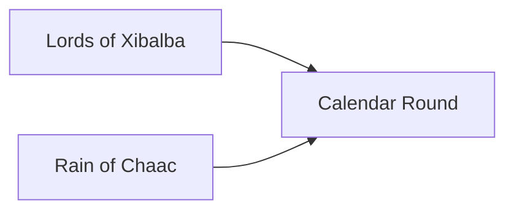

---
tags:
  - Civilization
  - Antiquity
  - Vanilla
---

[[Cultural]], [[Scientific]]

>*Atop stone pyramids, the forest canopy gives way to stars, and from here the Maya plot their fate. In the thrill of the ball-court and in the words of the ancient poems, their heroes enact the drama of creation. Rise to the conch-shell horn, and don the feathered headdress—the Maya set forth.*

## Unique Ability
##### *Skies of Itzamna*
- After researching a Technology, gain Culture equal to 10% of its cost
- After studying a Civic, gain Science equal to 10% of its cost

## Unique Infrastructure
##### Quarter: *Uwaybil K'uh*
- Every time you research a Technology, this Settlement gains Production equal to 5% of its cost
- Building: **Jalaw**
	- +3 Happiness
	- +1 Culture Adjacency for Quarters and Wonders
- Building: **K'uh Nah**
	- +3 Science
	- +2 Science if placed on Vegetation
	- +1 Science Adjacency for Wonders

## Unique Units
##### Ranged Unit: *Hul'che*
- Can see through Vegetation, and Vegetated Terrain does not end their Movement
##### Scout: *Jaguar Slayer*
- Can initiate combat
- Has 1 charge to place Jaguar Traps on Flat or Vegetated Terrain
- Traps are invisible to enemy Units, deal 25 damage, and end Movement
- This ability recharges 5 turns after placing a trap

## Civics – Antiquity
##### *Lords of Xibalba*
- Building: **Jalaw**
- Tradition: **Miracles of the Twins I**
	- All Units gain the Poison ability, +3 Combat Strength against Wounded Units
	- Scouts and Ranged Units gain Stealth in Vegetated Terrain
##### *Rain of Chaac*
- Building: **K'uh Nah**
- Tradition: **Pet Kot**
	- +1 Science on Improvements in Vegetated Terrain in Cities
##### *Calendar Round*
- +1 Tradition slot
- Wonder: **Mundo Perdido**
- Mastery
	- Tradition: **Tzolk'in I**
		- +2 Science on Happiness buildings
	- Tradition: **Haab' I**
		- +2 Culture on Happiness buildings
	- +1 Settlement Limit

## Civics – Exploration
##### *Renaissance*
- Tradition: **Miracles of the Twins II**
	- All Units gain the Poison ability, +3 Combat Strength against Wounded Units
	- Scouts and Ranged Units gain Stealth in Vegetated Terrain
	- Ranged Units ignore Vegetation for Movement
- +1 Settlement Limit
- +1 Tradition slot
##### *Hierarchy*
- Attribute Traditions: [[Cultural|Classical Revival]] and [[Scientific|Alchemy]]
- Wonder: **Notre Dame**
##### *Syncretism*
- Affirmation Tradition: **Milpa I**
	- +2 Science on Science Buildings placed on Vegetated Terrain

## Civics – Modern
##### *Modernization*
- Tradition: **Haab' II**
	- +2 Culture on Happiness buildings, doubled while in a Celebration
- Tradition: **Tzolk'in II**
	- +2 Science on Happiness buildings, doubled while in a Celebration
- +1 Settlement Limit
- +1 Tradition slot
##### *Administration*
- Attribute Traditions: [[Cultural|Romanticism]] and [[Scientific|Location Theory]]
- Wonder: **Taj Mahal**
##### *Syncretism*
- Affirmation Tradition: **Milpa II**
	- +2 Science on Happiness and Science Buildings placed on Vegetated Terrain

## Associated Wonder
##### *Mundo Perdido*
- Unlocked for any Civilization by the *Code of Laws II* Civic
- +1 Science on Improvements and +1 Happiness on Districts on Tropical Terrain in this Settlement
- Must be placed on Tropical

## Starting Biases
- Vegetated
- Tropical

.png/revision/latest)

>*The people lay these stones as a pathway to the heavens. Come, k'uhul ajaw, and assume the world's throne.*

