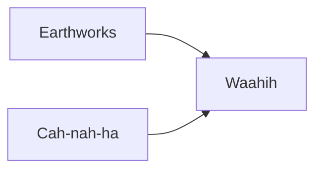

---
tags:
  - Civilization
  - Antiquity
  - Vanilla
---
  

[[Economic]], [[Expansionist]]

>*A new vision for the world arises from the mounds of Cahokia. The children of Red Horn and the Earthmaker shape the land as they see fit, building mountains out of plains, and cities out of the wilderness. As the burning arrow brings light to the darkness, the Mississippians bring new life to the world.*

## Unique Ability
##### *Goose Societies*
- All Buildings receive a +1 Food Adjacency for Resources
- +10% Production towards constructing Buildings

## Unique Infrastructure
##### Improvement: *Potkop*
- +1 Gold
- +1 Food for each adjacent Resource
- Must be placed on Flat Terrain

## Unique Units
##### Ranged Unit: *Burning Arrow*
- Increased Bombard Strength
- +3 Combat Strength against Siege Units
- Applies the Burning status to tiles for 2 turns
##### Merchant: *Watonathi*
- Gain 25 Gold per Resource acquired when creating a Trade Route

## Civics – Antiquity
##### *Earthworks*
- Improvement: **Potkop**
- Unlocks Merchants
- Wonder: **Monks Mound**
- Tradition: **Shell-Tempered Pottery I**
	- Food, Gold, and Warehouse Buildings receive a +1 Gold Adjacency for Resources
##### *Cah-nah-ha*
- Tradition: **Gift Economy I**
	- +1 Gold and Happiness for every imported Resource
- +1 Tradition slot
##### *Waahih*
- Tradition: **Buzzard Cult**
	- +3 Combat Strength for Land Units when defending
	- When making Peace with another Leader, Relationship with that Leader returns to Neutral and you get a free Merchant in your Capital
- +1 Settlement Limit

## Civics – Exploration
##### *Renaissance*
- Tradition: **Gift Economy II**
	- +2 Gold and Happiness from imported Resources
- +1 Settlement Limit
- +1 Tradition slot
##### *Hierarchy*
- Attribute Traditions: [[Economic|Supply and Demand]] and [[Expansionist|Yanakuna]]
- +1 Settlement Limit
##### *Syncretism*
- Affirmation Tradition: **Sacrificial Effigies I**
	- Ranged Units apply the Burning status to tiles for 2 turns when attacking

## Civics – Modern
##### *Modernization*
- Tradition: **Shell-Tempered Pottery I**
	- All Buildings receive a +1 Gold Adjacency for Resources
- +1 Settlement Limit
- +1 Tradition slot
##### *Administration*
- Attribute Traditions: [[Economic|Gold Standard]] and [[Expansionist|Industrial Agriculture]]
- +1 Settlement Limit
##### *Syncretism*
- Affirmation Tradition: **Sacrificial Effigies II**
	- Ranged Units apply the Burning status to tiles for 2 turns when attacking
	- +50 Gold per Resource on Trade Route creation (scales by Game speed)

## Associated Wonder
##### *Monks Mound*
- +3 Food
- +4 Resource Capacity in this Settlement
- Must be placed adjacent to a River

## Starting Biases
- Flat
- Rivers

>*A great dais rises from the earth, heralding a new day. What the Mississippians build will uphold the world.*
