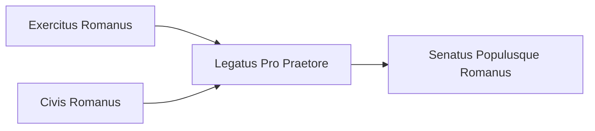

---
aliases:
tags:
  - Civilization
  - Antiquity
  - Vanilla
---

[[Cultural]], [[Militaristic]]

>*Rome: a name synonymous with power. Legend has it that the first Romans were raised by wolves. Seeing the debates in the Senate, the achingly straight Roman roads, and the well-ordered legions, one might doubt this. Seeing the light of ambition in Roman eyes, one does not. Raise the eagle standard, and let the world know the glory that is Rome.*

## Unique Ability
##### *Twelve Tables*
- +1/+1/+2 Culture on Districts in the Capital and City Centers in Towns
- Gain a free Infantry Unit in new Towns that you found

## Unique Infrastructure
##### Quarter: *Forum*
- +1 Culture for every Tradition in the Government
- Building: **Basilica**
	- +3 Influence
	- +1 Gold Adjacency for Culture Buildings and Wonders
- Building: **Temple of Jupiter**
	- +3 Happiness
	- +1 Culture Adjacency for Happiness Buildings and Wonders

## Unique Units
##### Infantry Unit: *Legion*
- +1 Combat Strength for every Tradition in the Government
##### Army Commander: *Legatus*
- Gains 1 charge to create a new Settlement for every 3 Levels it has

## Civics – Antiquity
##### *Exercitus Romanus*
- Building: **Temple of Jupiter**
- Tradition: **Auxilia I**
	- +3% Production towards Military Units in the Capital for every Town
	- Training an Infantry Unit grants Culture equal to 25% of its cost
##### *Civis Romanus*
- Building: **Basilica**
- Tradition: **Cursus Honorum**
	- +2 Culture on Diplomacy and Military Buildings, doubled if a Building is both
	- Army Commanders gain the Bulwark Promotion for free
##### *Legatus Pro Praetore*
- +1 Tradition slot
- +1 Settlement Limit
- Tradition: **Latinitas I**
	- +2 Food and Culture in Towns, doubled in Fort Towns
##### *Senatus Populusque Romanus*
- Tradition: **Princeps Civitatis I**
	- +1 Production on Districts in your Capital
- +1 Tradition slot
- +1 Settlement Limit
- Wonder: **Colosseum**

## Civics – Exploration
##### *Renaissance*
- Tradition: **Latinitas II**
	- +2 Food and Culture in Towns, doubled in Fort Towns; these numbers are doubled again in Distant Lands
- +1 Settlement Limit
- +1 Tradition slot
##### *Hierarchy*
- Attribute Traditions: [[Cultural|Classical Revival]] and [[Militaristic|Professional Army]]
- Wonder: **Notre Dame**
- +1 Settlement Limit
##### *Syncretism*
- Affirmation Tradition: **Limitanei I**
	- +1 Combat Strength for Infantry Units for every Tradition slotted in the Government

## Civics – Modern
##### *Modernization*
- Tradition: **Auxilia II**
	- +5% Production towards Military Units in the Capital for every Town
	- Training an Infantry Unit grants Culture equal to 50% of its cost
- Tradition: **Princeps Civitatis II**
	- +2 Production on Districts in your Capital
- +1 Settlement Limit
- +1 Tradition slot
##### *Administration*
- Attribute Traditions: [[Cultural|Romanticism]] and [[Militaristic|Force Structuring]]
- Wonder: **Taj Mahal**
- +1 Settlement Limit
##### *Syncretism*
- Affirmation Tradition: **Limitanei I**
	- +1 Combat Strength for Infantry Units for every Tradition slotted in the Government
	- +3 Culture in the Capital for every Town

## Associated Wonder
##### *Colosseum*
- Unlocked for any Civilization by the *Entertainment* Civic
- +3 Culture
- +1 Happiness and Gold on Quarters in this Settlement
- Must be placed adjacent to a District

## Starting Bias
- Grassland

.png/revision/latest)

>*A new banner unfurls, emblazoned with triumphal laurels. Rome seeks its champions.*

