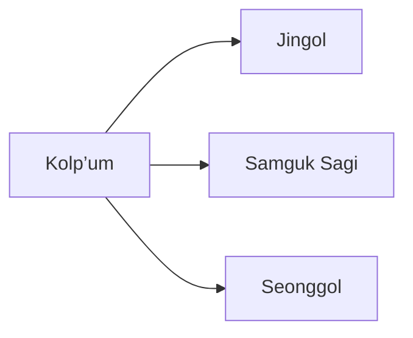

---
tags:
  - Civilization
  - Antiquity
  - DLC
---
*Available with the Silla Pack DLC*
*Included in the [[Right to Rule Collection]]*

  

[[Economic]], [[Diplomatic]]

>*The temple bell rings out across Korea, and Silla responds. In their palaces, the seonggol pursue a life of luxury, lending inspiration to the craftsman's hands, the poet's brush, and the soldier's step. Guide Silla now, and bring an enlightened hand to a darkened world.*

## Unique Ability
##### *Maripgan*
- When you form an Alliance, both Leaders receive a free Trade Route from the other Leader's Capital; these Trade Routes do not go away when the Alliance ends
- +1/+2/+3 Influence for each Civilization you have at least 1 Trade Route with

## Unique Infrastructure
##### Quarter: *Sachal*
- +1 Gold for every Resource assigned to this City
- Building: **Lecture Hall**
	- +3 Culture
	- +1 Culture Adjacency for Wonders
	- +1 Resource Capacity in this Settlement if placed on Rough Terrain
- Building: **Pagoda**
	- +3 Happiness
	- +1 Influence Adjacency for Natural Wonders, Mountains, and Wonders

## Unique Units
##### Ranged Unit: *Hwarang*
- Has +1 Movement and +3 Bombard Strength
- Counts as a Calvary Unit
##### Merchant: *Sangdaedeung*
- When you create a Trade Route, receive +5 Gold for the current Relationship Level with the Leader (On Standard Speed), does not apply to City-States
- Minimum 5 Gold

## Civics – Antiquity
##### *Kolp’um*
- Tradition: **Beopseong I**
	- +2 Happiness on Resources In Towns with a Happiness Building
- Building: **Pagoda**
- Building: **Lecture Hall**
##### *Jingol*
- Tradition: **Seorabeol I**
	- +1 Gold and Influence on Resources assigned Trade Outpost Towns
- +1 Tradition slot
##### *Samguk Sagi*
- Tradition: **Strategic Allies**
	- All Trade Routes between you and your allies grant Food and Production to both players equal to the route's Trade Income
- Wonder: **Emile Bell**
##### *Seonggol*
- Tradition: **The Golden Road I**
	- All Trade Routes between you and your allies grant Science and Culture to both players equal to 50% of the route's Trade Income
- Unlocks Merchants
- +1 Tradition slot

## Civics – Exploration
##### *Renaissance*
- Tradition: **Seorabeol I**
	- +2 Gold and Influence on Resources assigned Trade Outpost Towns
- +1 Tradition slot
##### *Hierarchy*
- Attribute Traditions: [[Diplomatic|Spy Network]] and [[Economic|Supply and Demand]]
##### *Syncretism*
- Affirmation Tradition: **Revised Bone-Rank I**
	- +1 Culture and Science for each imported Resource

## Civics – Modern
##### *Modernization*
- Tradition: **The Golden Road II**
	- All Trade Routes between you and your allies grant Science and Culture to both players equal to the route's Trade Income
- +1 Tradition slot
##### *Administration*
- Attribute Traditions: [[Diplomatic|The Great Game]] and [[Economic|Gold Standard]]
- Tradition: **Beopseong II**
	- +2 Happiness on Resources In Towns
##### *Syncretism*
- Affirmation Tradition: **Revised Bone-Rank II**
	- +2 Culture and Science for each imported Resource

## Associated Wonder
##### *Emile Bell*
- Unlocked for any Civilization by the *Citizenship* Civic
- +2 Influence
- Gain a unique Diplomatic Endeavor called **Ginseng Agreement** that grants food to both Leaders' Cities
- +1 Diplomatic Attribute Point
- Must be placed on Rough Terrain

## Starting Biases
- Rough
- Grassland

