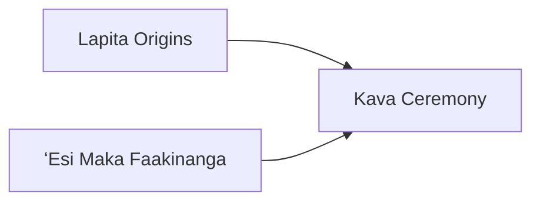

---
aliases:
tags:
  - Antiquity
  - DLC
  - Civilization
---
*Available with the Tonga Pack DLC*
*Included in the [[Tides of Power Collection]]*
  
  

[[Diplomatic]], [[Expansionist]]

>*Across the trackless seas the double-hulled Tongan ships sail, guided by nothing but the stars. The singer's chant drives them forward, to seek new sea-stone harbors, new atolls and fishing grounds. Listen to the slit-drum, and the rush of waves on the hull – a new shore awaits.*

## Unique Ability
##### *Lords of the South*
- +1/+2/+3 Influence on the Palace and City Halls in Settlements adjacent to Coast
- Receive a free Trade Route from a new City-State when you become their Suzerain
- [Ant] Cannot use the City-State - Incorporate or the Levy Unit Action
- [Exp] Trade Routes can cross Ocean without taking damage

## Unique Infrastructure
##### Quarter: *Tofi'a*
- +2 Culture for every Trade Route you have to a City-State
- Building: **Langi**
	- +3 Culture
	- +1 Food Adjacency for Resources and Wonders
- Building: **Vaikaukau**
	- +3 Happiness
	- +1 Culture Adjacency for Coast and Wonders

## Unique Units
##### Scout: *Tehina*
- Can enter Ocean (does not take damage)
- Cannot disembark in Distant Lands
- Can use Coastal Raid on adjacent Discoveries and embark at the start of the Age
##### Naval Unit: *Kalia*
- +5 Combat Strength against Fortified Districts

## Civics – Antiquity
##### *Lapita Origins*
- Building: **Vaikaukau**
- Tradition: **Takuaka**
	- +1 Production on Fishing Boats in Cities
	- +2 Science on Fishing Boats on Reefs in all Settlements
- +1 Tradition slot
##### *ʻEsi Maka Faakinanga*
- Building: **Langi**
- +1 Settlement Limit
- Tradition: **Tongiaki I**
	- +10 Naval Trade Route Range
##### *Kava Ceremony*
- Wonder: **Ha'amonga 'a Maui**
- +1 Tradition slot
- Tradition: **Ngatu I**
	- +100% Influence towards initiating and progressing the Befriend Independent Project, if the Independent Power is in Distant Lands

## Civics – Exploration
##### *Renaissance*
- Tradition: **Tongiaki II**
	- +10 Naval Trade Route Range
	- +3 Gold and Science from Naval Trade Routes
- +1 Settlement Limit
- +1 Tradition slot
##### *Hierarchy*
- Attribute Traditions: [[Diplomatic|Spy Network]] and [[Economic|Supply and Demand]]
##### *Syncretism*
- Affirmation Tradition: **T'ui Ha'atakalaua I**
	- +3 Culture and Gold in the Capital for every Trade Route with a City-State

## Civics – Modern
##### *Modernization*
- Tradition: **Ngatu II**
	- +100% Influence towards initiating and supporting the Befriend Independent Project, if the Independent Power is in Distant Lands
	- +100% Influence towards all City-State Actions if the City-State is in Distant Lands
- +1 Settlement Limit
- +1 Tradition slot
##### *Administration*
- Attribute Traditions: [[Diplomatic|The Great Game]] and [[Economic|Gold Standard]]
##### *Syncretism*
- Affirmation Tradition: **T'ui Ha'atakalaua I**
	- +4 Culture and Gold in the Capital for every Trade Route with a City-State

## Associated Wonder
##### *Ha'amonga 'a Maui*
- +2 Culture
- +1 Culture and Food on Fishing Boats in this Settlement
- +1 Cultural Attribute Point
- Must be placed adjacent to Coast

## Starting Biases
- Coast
- Tropical

