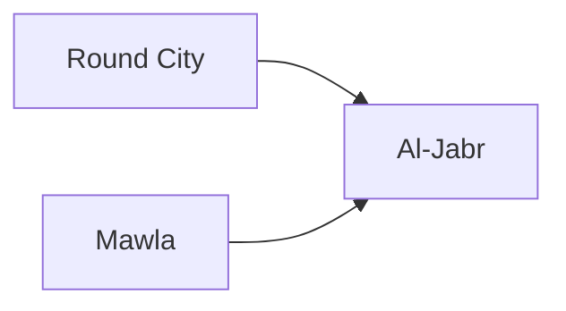

---
tags:
  - Civilization
  - Exploration
  - Vanilla
---

[[Expansionist]], [[Scientific]]

>*The second of the great Arab caliphates, the Abbasid Dynasty is the heart of wisdom. As the knowledge of the world and the heavens flows inwards to Abbasid libraries, Abbasid scholars are guided by the tenets of their faith, and their devotion to expanding the frontiers of science and commerce. Seek, read, discover – the world is yours.

## Unlocked
- Improve three Camels
- Civilizations
	- [[Achaemenid Persia]]
	- [[Assyria]]
	- [[Egypt]]
- Leader
	- [[Ada Lovelace]]
	- [[Alexander the Great]]
	- [[Amina]]
	- [[Augustus]]
	- [[Gilgamesh]]
	- [[Hatshepsut]]
	- [[Ibn Battuta]]
	- [[Isabella]]
	- [[Sayyida al Hurra]]
	- [[Xerxes, the Achaemenid]]
	- [[Xerxes, King of Kings]]

## Unique Ability
##### *Madina*
- [Ant] Receive 10 Gold for each Rural Population of a City when it has a Growth Event (Scales by Game Speed)
- [Exp/Mod] Receive 30/50 Gold for each Rural Population of a City when you create a Specialist (Scales by Game Speed)
- [Exp/Mod] +20%/+30% Production towards constructing Buildings in Cities with at least 5/8 Specialists

## Unique Infrastructure
##### Quarter: *Ulema*
- +1 Science to all Specialists in this City
- Building: **Madrasa**
	- +6 Science
	- +1 Science Adjacency for Quarters, Science Buildings, and Wonders
- Building: **Mosque**
	- +6 Happiness
	- +1 Culture Adjacency for Happiness Buildings and Wonders
	- +1 Happiness Adjacency for Culture Buildings and Wonders
	- Unlocks the ability to found a Religion

## Unique Units
##### Cavalry Unit: *Mamluk*
- Has the Skirmish ability
- When attacking in your Settlements, +5 Combat Strength in towns and in Cities with at least 5 Specialists
##### Great Person: *'Alim*
- Can only be trained in Cities with an Ulema
- **Al-Farabi**: Activate on a Science Building; receive a free random unlocked Technology
- **Al-Farghani**: Create an Observatory in a City; this Observatory receives +2 Science
- **Al-Jahiz**: Create a Menagerie in a City; this Menagerie receives +2 Happiness
- **Al-Jazari**: Activate on a District with at least 1 Specialist Limit, this tile gets +1 Specialists; 2 charges
- **Al-Khwarizmi**: Activate on a completed Ulema; Each Building in this Quarter gains +3 Science
- **Al-Maqdisi**: Activate in another Civilization; gain 50 Gold for every improved Resource tile this Settlement has (on Standard Speed)
- **Al-Shaybani**: Activate on a Culture Building; receive an additional Social Policy slot
- **Ibn Fadlan**: Activate on a Navigable River; receive 50 Influence for every tile of this River (on Standard Speed)
- **Ibn Sina**: Create a Hospital in a City; this Hospital gains +2 Food; tile must have less than 2 Buildings and the City cannot have a Hospital
- **Rabia of Basra**: Activate on a Happiness Building; +10% Happiness in this Settlement

## Civics – Antiquity
##### *Origins*
- Tradition: **City of Peace I**
	- All Buildings receive a +1 Science Adjacency with the Palace
- +1 Tradition slot
##### *Foundation*
- Attribute Traditions: [[Expansionist|Fractal Cities]] and [[Scientific|Experimentation]] 
- +1 Specialist Limit in the Capital for this Age
- Gain 1 Codex
##### *Syncretism*
- Affirmation Tradition: **Rasool I**
	- Buildings gain a +1 Happiness Adjacency for the Palace

## Civics – Exploration
##### *Round City*
- Building: **Mosque**
- Tradition: **City of Peace II**
	- All Buildings receive a +1 Science Adjacency with the City Hall and Palace
- +1 Tradition slot
##### *Mawla*
- Building: **Madrasa**
- Tradition: **Sales and Trade I**
	- +1 Gold and Science for each Resource assigned to Cities with at least 5 Specialists
- +1 Tradition slot
##### *Al-Jabr*
- Tradition: **Compendious Book**
	- +2 Happiness and Science in Towns
- Wonder: **House of Wisdom**

## Civics – Modern
##### *Modernization*
- Tradition: **Sales and Trade II**
	- +2 Gold and Science for each Resource assigned to Cities with at least 5 Specialists
- +1 Tradition slot
##### *Administration*
- Attribute Traditions: [[Expansionist|Developmentalism]] and [[Scientific|Location Theory]]
- +1 Specialist Limit in the Capital for this Age
##### *Syncretism*
- Affirmation Tradition: **Rasool II**
	- Buildings gain a +1 Happiness Adjacency for the City Hall and Palace

## Associated Wonder
##### *House of Wisdom*
- Unlocked for any Civilization by the *Society II* Civic
- +3 Science
- Gain 1 Relic
- Has 3 Great Work slots
- +2 Science from Great Works
- +3 Innovation
- Must be placed adjacent to a District

## Starting Biases
- Coast
- Camels

.png/revision/latest)

>*Bahamut rumbles and sways the jacinth slab of Kuyutha. The Abbasids' weight will realign the balance of the world.*

