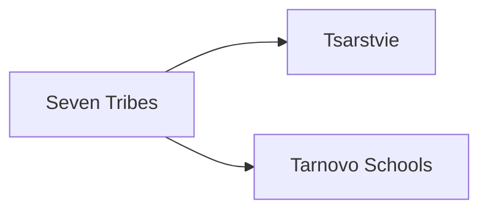

---
aliases:
tags:
  - Civilization
  - Exploration
  - DLC
---
*Available with the Bulgaria Pack DLC*
*Included in the [[Crossroads of the World Collection]]*

[[Expansionist]], [[Militaristic]]

>*Atop the high peaks, the monks send their prayers skyward, and on the plains below, the trumpet sounds. Bulgaria rides, with swords guided by faith and faith stronger than steel. Raise the war-horn and the saver, the arkani and the long spear, and set the Bulgars loose upon the world.*

## Unlocked
- Have three Altars
- Civilizations
	- [[Achaemenid Persia]]
	- [[Greece]]
- Leaders
	- [[Augustus]]
	- [[Catherine the Great]]
	- [[Charlemagne]]
	- [[Genghis Khan]]

## Unique Ability
##### *Krum's Dynasty*
- Receive Production in all Cities when pillaging Improvements equal to 50% of the HP or yields gained
- -3 Combat Strength for all Combat Units against Fortified Districts

## Unique Infrastructure
##### Improvement: *Hidden Fortress*
- +4 Production
- +2 Culture for each adjacent Mountain
- Units on this tile gain Stealth
- Counts as a Fortification, +6 Combat Strength when defending
- Must be placed on Rough Terrain not adjacent to another Hidden Fortress

## Unique Units
##### Cavalry Unit: *Bolyar*
- Ignores Rough Terrain for Movement and enemy Unit's Combat Strength
- +3 Combat Strength Rough Terrain
##### Army Commander: *Tarkhan*
- Has 3 Movement
- Units in its Command Radius can Pillage for 1 Movement

## Civics – Antiquity
##### *Origins*
- Tradition: **Stratagems I**
	- +50% yields and HP from pillaging
	- +3 Combat Strength for Infantry and Cavalry against other Land Units when you have at least 4 Great Works on display
- +1 Tradition slot
- +1 Settlement Limit
##### *Foundation*
- Attribute Traditions: [[Expansionist|Fractal Cities]] and [[Militaristic|Warrior Class]]
- +2 Settlement Limit
##### *Syncretism*
- Affirmation Tradition: **Uporitost I**
	- +2 Production on displayed Great Works

## Civics – Exploration
##### *Seven Tribes*
- Improvement: **Hidden Fortress**
- Tradition: **False Retreat**
	- Receive Food in all Towns when pillaging Buildings equal to 50% of the Yield or HP gained
	- -3 Combat Strength for all Combat Units against Fortified Districts
##### *Tsarstvie*
- Tradition: **Stratagems II**
	- +50% Yield and HP from Pillaging
	- +5 Combat Strength for Infantry and Cavalry against other Land Units when you have at least 8 Great Works on display
##### *Tarnovo Schools*
- Tradition: **Iconolatry I**
	- +1 Happiness and Gold from Great Works
- Wonder: **Rila Monastery**
- Gain 1 Relic

## Civics – Modern
##### *Modernization*
- Tradition: **Iconolatry II**
	- +1 Happiness and Gold from Great Works
	- +3 Happiness on Hidden Fortresses in Settlements with a Great Work Slot
- +1 Tradition slot
- +1 Settlement Limit
##### *Administration*
- Attribute Traditions: [[Expansionist|Industrial Agriculture]] and [[Militaristic|Force Structuring]]
- +2 Settlement Limit
##### *Syncretism*
- Affirmation Tradition: **Uporitost II**
	- +3 Production on displayed Great Works
	- Land Units can Pillage for 1 Movement

## Associated Wonder
##### *Rila Monastery*
- Unlocked for any Civilization by the *Heraldry* Technology
- +4 Culture
- Has 3 Great Work Slots
- Gain a Relic every time you construct a Wonder, including this one
- Cannot be placed adjacent to a District

## Starting Bias
- Rough

.png/revision/latest)

>*As the horseman tramples the dragon, Bulgaria shall overrun the earth.*

