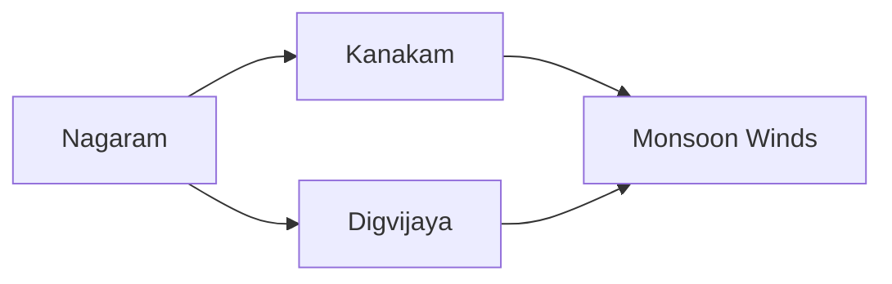

---
tags:
  - Civilization
  - Exploration
  - Vanilla
---

[[Diplomatic]], [[Economic]]

>*The greatest of the Tamil dynasties, the Chola lords rule the seas. Their touch extends outward, across networks of merchant houses, to the poets and philosophers of the Sanskrit world, and to artists and scholars. Each seek to capture the dreams of the fleeting world, for a time. Extend your grasp – though the seas are ever-changing, make your mark.*

## Unlocked
- Have three Settlements with City Centers adjacent to a Coastal tile (Lakes do not count)
- Civilizations
	- [[Khmer]]
	- [[Maurya]]
- Leaders
	- [[Ashoka, World Conqueror]]
	- [[Ashoka, World Renouncer]]
	- [[Gilgamesh]]
	- [[Lakshmibai]]
	- [[Trung Trac]]

## Unique Ability
##### *Samayam*
- +1 Trade Route from the Improve Trade Relations Action
- +2/+3/+4 Gold and +1/+2/+3 Influence for every active Trade Route
- +1 Movement for Merchants
- [Exp/Mod] +1 GDP per turn for imported Resources assigned to Cities

## Unique Infrastructure
##### Quarter: *Five Hundred Lords*
- +5 Land Trade Range and +15 Naval Trade Range
- Building: **Manigramam**
	- +6 Happiness
	- +1 Gold Adjacency for Quarters and Wonders
	- +1 Happiness Adjacency for Gold Buildings and Wonders
	- Must be placed adjacent to Coast
- Building: **Anjuvannam**
	- +6 Gold
	- +1 Gold Adjacency for Coastal Terrain, Navigable Rivers, and Wonders
	- +50% Production towards Naval Units
	- Must be placed adjacent to Coast

## Unique Units
##### Heavy Naval Unit: *Kalam*
- +1 additional attack per turn if movement allows
- Has reduced base Movement
##### Fleet Commander: *Ottru*
- Has +1 Movement and greater Sight
- Opposing Military Units in the Command Radius receive -3 Combat Strength

## Civics – Antiquity
##### *Origins*
- Tradition: **Devakoshta I**
	- +2 Culture on Gold Buildings
- Unlocks Merchants
- Gain a free Merchant
- +1 Settlement Limit
- +1 Tradition slot
##### *Foundation*
- Attribute Traditions: [[Diplomatic|Emissaries]] and [[Economic|Merchant Class]]
##### *Syncretism*
- Affirmation Tradition: **Veera Banaju Dharma I**
	- +5 Influence if you have 5 or more Trade Routes
	- +50% Production towards training Merchants

## Civics – Exploration
##### *Nagaram*
- Building: **Manigramam**
- Building: **Anjuvannam**
- Wonder: **Brihadeeswarar Temple**
##### *Kanakam*
- Tradition: **Devakoshta II**
	- +3 Culture on Gold Buildings
	- +50% Influence towards Diplomatic Actions with other Leaders if you have at least 5 Trade Routes
- +1 Tradition slot
##### *Digvijaya*
- Tradition: **Marakkalam**
	- +1 Combat Strength for Naval Units for every other Civilization with which you have a Trade Route
	- +1 Movement and Sight for Heavy Naval Units
- +1 Tradition slot
##### *Monsoon Winds*
- Tradition: **Angadi I**
	- +2 Resource Capacity in the Capital
	- +4 Gold in Settlements other than the Capital if they have a Water Building
- +1 Settlement Limit

## Civics – Modern
##### *Modernization*
- Tradition: **Angadi II**
	- +2 Resource Capacity in the Capital
	- +8 Gold in Settlements other than the Capital if they have a Water Building
- +1 Settlement Limit
- +1 Tradition slot
##### *Administration*
- Attribute Traditions: [[Diplomatic|The Great Game]] and [[Economic|Gold Standard]]
##### *Syncretism*
- Affirmation Tradition: **Veera Banaju Dharma I****
	- +10 Influence if you have 5 or more Trade Routes
	- +100% Production towards training Merchants

## Associated Wonder
##### *Brihadeeswarar Temple*
- Unlocked for any Civilization by the *Diplomatic Service* Civic
- +3 Influence
- All Buildings in this Settlement gain a +1 Happiness Adjacency for Navigable Rivers
- Must be placed adjacent to a Navigable River or on a Minor River

## Starting Biases
- Coast
- Tropical

.png/revision/latest)

>*The monsoon gathers, filling sails and banners, pushing the fierce Chola toward their destiny.*

