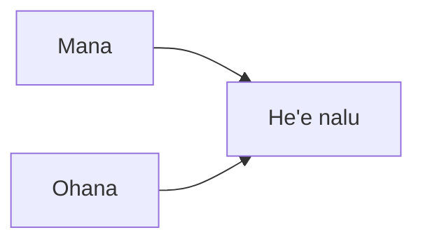

---
aliases:
tags:
  - Civilization
  - Exploration
  - Vanilla
---
  

[[Cultural]], [[Expansionist]]

>*The world's greatest sailors, the Hawaiians venture forth when all others fail. With the blessing of their kahuna, they brave the blue expanse in search of new lands to sow with taro, new treasures to collect, and new legacies to forge. The conch is blowing, the wind is right – it is time for the oar to bite water.*

## Unlocked
- Have two Settlements on an Island (a landmass with a maximum of 30 tiles)
- Civilizations
	- [[Maya]]
	- [[Mississippian]]
	- [[Tonga]]
- Leaders
	- [[Ashoka, World Conqueror]]
	- [[Ashoka, World Renouncer]]
	- [[Himiko, High Shaman]]
	- [[Himiko, Queen of Wa]]
	- [[José Rizal]]
	- [[Pachacuti]]
	- [[Tecumseh]]

## Unique Ability
##### *Moananuiākea*
- Can work Ocean Terrain
- +1/+2/+2 Culture on all Marine Terrain
- [Exp/Mod] +1 Happiness on all Marine Terrain

## Unique Infrastructure
##### Improvement: *Lo'i Kalo*
- +3 Food and +2 Production
- +1 Culture for each adjacent Fishing Boat
- Must be placed on Grassland or Tropical

## Unique Units
##### Infantry Unit: *Leiomano*
- +3 Combat Strength against Infantry and Cavalry Units
- +5 Combat Strength defending against Naval Units
##### Missionary: *Kahuna*
- Has an action to heal adjacent Units

## Civics – Antiquity
##### *Origins*
- Tradition: **Ho'okupu I**
	- +1 Food on Marine Terrain
	- Improvements, Buildings, and Districts do not get pillaged by Floods, Volcanic Eruptions, and Hurricanes
- +1 Settlement Limit
- +1 Tradition slot
##### *Foundation*
- Attribute Traditions: [[Cultural|Enlightened Rule]] and [[Expansionist|Fractal Cities]]
- Wonder: **Pyramid of the Sun**
- +1 Settlement Limit
##### *Syncretism*
- Affirmation Tradition: **Hōkūleʻa I**
	- +1 Culture on Districts and Unique Improvements adjacent to Coast

## Civics – Exploration
##### *Mana*
- Tradition: **Kapa**
	- +50% Production towards constructing Culture Buildings
- +1 Tradition slot
##### *Ohana*
- Improvement: **Lo'i Kalo**
- Tradition: **Ahupuaʻa I**
	- +4 Food on Culture Buildings
- +1 Tradition slot
##### *He'e nalu*
- +2 Relics
- +1 Settlement Limit
- Tradition: **Ho'okupu II**
	- +2 Food on Marine Terrain
	- Improvements, Buildings, and Districts do not get pillaged by Floods, Volcanic Eruptions, and Hurricanes
- Wonder: **Hale o Keawe**

## Civics – Modern
##### *Modernization*
- Tradition: **Ahupuaʻa II**
	- +6 Food on Culture Buildings
- +1 Settlement Limit
- +1 Tradition slot
##### *Administration*
- Attribute Traditions: [[Cultural|Romanticism]] and [[Expansionist|Industrial Agriculture]]
- Wonder: **Taj Mahal**
- +1 Settlement Limit
##### *Syncretism*
- Affirmation Tradition: **Hōkūleʻa II**
	- +2 Culture on Districts and Unique Improvements adjacent to Coast
	- +4 Culture on Volcanoes

## Associated Wonder
##### *Hale o Keawe*
- Unlocked for any Civilization by the *Inspiration* Civic
- +2 Culture
- +1 Culture on Water Buildings
- Has 3 Great Work slots
- Must be built on Coast adjacent to land, but not adjacent to Tundra

## Starting Biases
- Coast
- Marine

>*The oceans whisper of a new power rising with the tide. The masters of waves will take a name forever remembered – Hawaii.*
