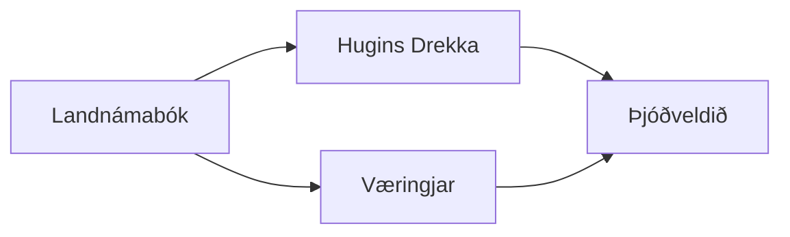

---
aliases:
tags:
  - Exploration
  - Civilization
  - DLC
---
*Available with the Iceland Pack DLC*
*Included in the [[Tides of Power Collection]]*
  
  

[[Cultural]], [[Militaristic]]

>*From the rugged north, the Icelanders burst forth on dragon-headed ships with Óðinn on their side. No shore is spared the fury of Norse warriors. Their ample spoils adorn longhouse walls, their deeds are made immortal by saga-writers and skalds. Ready your axe and raise your oar – the Viking Age begins.*

## Unlocked
- Be the first to discover a Natural Wonder
- Coastal Raid 5 times
- Civilizations
	- [[Rome]]
- Leaders
	- [[Edward Teach]]
	- [[Isabella]]
	- [[José Rizal]]

## Unique Ability
##### *Kringla Heimsins*
- +1 Sight for Naval Units
- [Ant] Gain 250 Culture when you discover a Natural Wonder (On Standard Speed)
- [Exp] Gain 500 Culture when you discover a Natural Wonder in Distant Lands (On Standard Speed)
- [Exp] Gain a Relic every time you study a Civic Mastery
- [Exp] -50% Production towards training Missionaries, and Missionaries cost 100% more Gold to purchase
- [Mod] +4 Culture on Natural Wonder and Volcano Tiles
- [Mod] Naval Units can Coastal Raid Archaeology Sites, gaining 2 Artifacts and removing the site

## Unique Infrastructure
##### Improvement: *Þingstaðr*
- +4 Happiness
- +1 Culture Adjacency for Wet, Floodplains, Volcano, and Vegetated tiles
- Must be placed in Tundra or Grassland not adjacent to another Þingstaðr

## Unique Units
##### Heavy Naval Unit: *Víkingr*
- +1 Combat Strength for each improved Natural Wonder in your empire
- Grants Science equal to 25% of Pillage Yields and Healing
- Has 3 Sight
##### Great Person: *Saga Hero*
- Can only be trained in Settlements with a Þingstaðr 
- **Egill Skallagrímsson**: Activate on a Fleet Commander. When you defeat an enemy Unit in its Command Radius receive Culture equal to 25% of the defeated Unit's Strength.
- **Freydís Eiríksdóttir**: Activate on a Naval Unit. This turn, Naval Units can Coastal Raid for no Movement cost.
- **Gísli Súrsson**: Activate on a Military Unit. This Unit gains the Stealth ability, becoming invisible to Units that are not in an adjacent tile.
- **Grettir Ásmundarson**: Activate on an Army Commander. Nearby Infantry Units gain the Splash ability, enemy Units in tiles adjacent to the target also take 25% damage.
- **Guðríðr Þorbjarnardóttir**: Activate on a Naval Unit. This Unit gains +1 Movement and +1 Sight.
- **Guðrún Ósvífrsdóttir**: Activate on a Commander. All units of its domain in the Command Radius are healed fully.
- **Gunnarr Hámundarson**: Activate on an Army or Fleet Commander in a tile with a Military Unit in the same tile. This Commander gains the Order Commendation.
- **Hrafnkell Hallfreðsson**: Activate on a Temple. Whenever you Coastal Raid, it spreads Religion to the Settlement that has been Coastal Raided. If the tile Raided is an Improvement, the Rural Religion changes; if the tile is Urban, the Urban Religion changes.
- **Kjartan Óláfsson**: Activate on a foreign Pillaged tile. Gain 1 Relic.
- **Njáll Þorgeirsson**: Activate on a Þingstaðr. +2 Culture on Þingstaðr in this Settlement for each Celebration

## Civics – Antiquity
##### *Origins*
- Tradition: **Dróttkvætt I**
	- Coastal Raiding and Pillaging with Naval Units grants Culture equal to 25% of Pillage Yields and Healing
- +1 Settlement Limit
- +1 Tradition slot
##### *Foundation*
- Attribute Traditions: [[Cultural|Enlightened Rule]] and [[Militaristic|Warrior Class]]
- Wonder: **Pyramid of the Sun**
- +1 Settlement Limit
##### *Syncretism*
- Affirmation Tradition: **Drekahöfuð I**
	- Training a Naval Unit grants Culture equal to 50% of the Unit's Production cost

## Civics – Exploration
##### *Landnámabók*
- Improvement: **Þingstaðr**
- Tradition: **Dróttkvætt II**
	- Coastal Raiding and Pillaging with Naval Units grants Culture equal to 50% of Pillage Yields and Healing
- Mastery
	- Tradition: **Reiði Guðanna**
		- All Buildings gain a +1 Culture and Production Adjacency from Volcanoes and Natural Wonders (Natural Wonder Volcanoes do not count twice)
		- +25% Gold towards purchasing Repairs
	- +1 Tradition slot
##### *Hugins Drekka*
- Tradition: **Strandhögg**
	- Naval Units can Pillage and Coastal Raid within 2 tiles
	- Naval Units can disperse Independent Powers or Coastal Raid for 1 Movement when in Distant Lands
	- Does not apply to Discoveries
##### *Væringjar*
- Tradition: **Lyfsteinn I**
	- +10 Healing for Naval Units outside friendly territory
- +1 Settlement Limit
##### *Þjóðveldið*
- Gain 2 Relics
- Wonder: **Reykjaholt**
- +1 Tradition slot

## Civics – Modern
##### *Modernization*
- Tradition: **Lyfsteinn II**
	- +20 Healing for Naval Units outside friendly territory
- +1 Settlement Limit
- +1 Tradition slot
##### *Administration*
- Attribute Traditions: [[Cultural|Romanticism]] and [[Militaristic|Force Structuring]]
- Wonder: **Taj Mahal**
- +1 Settlement Limit
##### *Syncretism*
- Affirmation Tradition: **Drekahöfuð II**
	- Training a Naval Unit grants Culture equal to 50% of the Unit's Production cost
	- +1 Combat Strength for Naval Units for each improved Natural Wonder in your empire

## Associated Wonder
##### *Reykjaholt*
- Unlocked for any Civilization by the *Society II* Civic
- +3 Culture
- +25% Production towards Military Units in this City for every Great Work in this City
- Has 3 Relic slots
- Must be placed on Tundra

## Starting Biases
- Coastal
- Tundra
- Grassland

