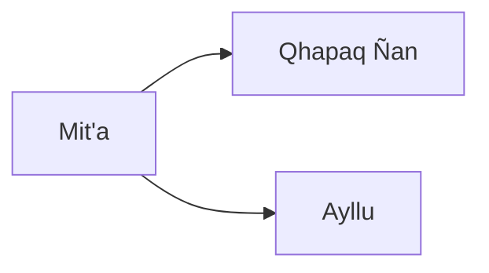

---
aliases:
tags:
  - Civilization
  - Exploration
  - Vanilla
---

[[Economic]], [[Expansionist]]

>*In the stony heights, the Inca create an empire where few others dare to tread. Guided by the condor's flight and the puma's track, they chart connections from peak to peak, building fortresses in the mountains. From these heights, decide whether to send down prosperity and wisdom – or a hail of sling stones.*

## Unlocked
- Have three Settlements with at least three Mountains each
- Civilizations
	- [[Maya]]
	- [[Mississippian]]
- Leaders
	- [[Harriet Tubman]]
	- [[Pachacuti]]
	- [[Simón Bolívar]]

## Unique Ability
##### *Apus*
- Can work Mountain Terrain
- +1/+2/+3 Food and +1/+1/+2 Production on Mountain Terrain
- [Exp] Can generate Homelands Treasure Convoys in Cities with 3 Worked Mountains after completing the *Qhapaq Ñan* Civic

## Unique Infrastructure
##### Improvement: *Terrace Farm*
- +4 Food
- +1 Gold to all adjacent Buildings
- Must be placed on Rough Terrain without a River or Feature

## Unique Units
##### Ranged Unit: *Warak'aq*
- Has +1 Movement and Rough Terrain does not end its Movement
- +5 Combat Strength when attacking from Rough Terrain
##### Scout: *Chasqui*
- +1 Movement
- Has increased Sight that ignores Mountains and Rough Terrain

## Civics – Antiquity
##### *Origins*
- Tradition: **Tirakuna I**
	- Food Buildings receive an Adjacency for Mountains
	- Rough Terrain does not end Unit Movement
- +1 Tradition slot
##### *Foundation*
- Attribute Traditions: [[Economic|Merchant Class]] and [[Expansionist|Fractal Cities]]
- +1 Specialist Limit in the Capital for this Age
##### *Syncretism*
- Affirmation Tradition: **Huaca I**
	- +10% Food in Settlements with their City Center adjacent to a Mountain or with 3 worked Mountain tiles

## Civics – Exploration
##### *Mit'a*
- Improvement: **Terrace Farm**
- Tradition: **Tirakuna II**
	- Food and Gold Buildings receive an Adjacency for Mountains
	- Rough Terrain does not end Unit Movement
- +1 Tradition slot
##### *Qhapaq Ñan*
- Cities in Homelands with 3 Worked Mountains generate Treasure Convoys worth 2 Cargo each
- Tradition: **Quipu**
	- Settlements receive +0.5 Gold for every Urban Population and +0.5 Production for every Rural Population
##### *Ayllu*
- Wonder: **Machu Pikchu**
- Tradition: **Qullqa I**
	- Cities receive +1 Food for each active Trade Route you started

## Civics – Modern
##### *Modernization*
- Tradition: Tradition: **Qullqa II**
	- Cities receive +2 Food for each active Trade Route you started
- +1 Tradition slot
##### *Administration*
- Attribute Traditions: [[Economic|Gold Standard]] and [[Expansionist|Developmentalism]]
- +1 Specialist Limit in the Capital for this Age
##### *Syncretism*
- Affirmation Tradition: **Huaca II**
	- +15% Food in Settlements with their City Center adjacent to a Mountain or with 3 worked Mountain tiles

## Associated Wonder
##### *Machu Pikchu*
- Unlocked for any Civilization by the *Urban Planning* Technology
- +4 Gold
- Buildings in this Settlement gain a +1 Culture and Gold Adjacency for Mountains
- Must be placed on a Grassland or Tropical Mountain

## Starting Biases
- Coast
- Mountains
- Desert
- Plains

.png/revision/latest)

>*The mountain valleys will sound with hammer and spade as the Inca enrich the land.*

