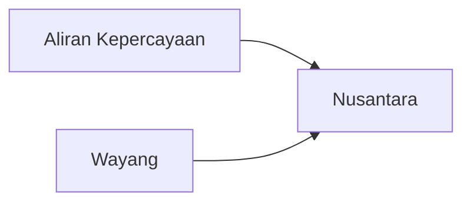

---
tags:
  - Civilization
  - Exploration
  - Vanilla
---

[[Cultural]], [[Expansionist]]

>*The Majapahit sail between a thousand islands, bringing with them their tales of heroes and gods. As the sun sets, weary sailors gather to hear the gamelan, and see their tales performed in shadow on the silken screen. Beauty is divine, claim the Majapahit poets, and divinity is power.*

## Unlocked
- Improve three Pearls
- Have three Naval Trade Routes
- Civilizations
	- [[Khmer]]
	- [[Maurya]]
- Leaders
	- [[Himiko, High Shaman]]
	- [[Himiko, Queen of Wa]]
	- [[José Rizal]]
	- [[Trung Trac]]

## Unique Ability
##### *Negara*
- Culture Buildings gain an adjacency for Coast
- +1 Specialist Limit in Districts on or adjacent to Coast
- If you transition away from the Majapahit, the Specialist Limit increase goes away; Specialists over the Limit become inactive until you increase the Limit

## Unique Infrastructure
##### Quarter: *Pura*
- +10% Gold towards converting a Town to a City
- Receive 1 Relic when completed
- Building: **Meru**
	- +6 Happiness
	- +1 Happiness Adjacency for Mountains and Wonders
	- +2 Happiness on Natural Wonders
- Building: **Candi Bentar**
	- +6 Culture
	- +1 Culture Adjacency for Coastal Terrain, Navigable Rivers, and Wonders

## Unique Units
##### Heavy Naval Unit: *Cetbang*
- +5 Combat Strength against Naval Units
- Can Coastal Raid within 2 tiles for 1 Movement
##### Missionary: *Pedanda*
- Also receive 25 Culture when you convert a Settlement for the first time

## Civics – Antiquity
##### *Origins*
- Tradition: **Awisan Dalem I**
	- +1 Culture on Marine Terrain in Cities
- +1 Settlement Limit
- +1 Tradition slot
##### *Foundation*
- Attribute Traditions: [[Cultural|Enlightened Rule]] and [[Expansionist|Fractal Cities]]
- Wonder: **Pyramid of the Sun**
- +1 Specialist Limit in the Capital for this Age
##### *Syncretism*
- Affirmation Tradition: **Subak I**
	- +2 Food on Quarters on or adjacent to Coast
	- +10% Growth Rate in Settlements adjacent to Coast

## Civics – Exploration
##### *Aliran Kepercayaan*
- Building: **Meru**
- Tradition: **Negarakertagama I**
	- +33% Food towards maintaining Specialists
- +1 Tradition slot
##### *Wayang*
- Building: **Candi Bentar**
- Tradition: **Panji**
	- +1 Culture from Specialists on or adjacent to Coast
- +1 Tradition slot
##### *Nusantara*
- Tradition: **Awisan Dalem II**
	- +1 Culture and +1 Production on Marine Terrain in Cities
- +1 Settlement Limit
- Wonder: **Borobudur**

## Civics – Modern
##### *Modernization*
- Tradition: **Negarakertagama I**
	- +33% Food towards maintaining Specialists
	- +4 Culture on Quarters on or adjacent to Coast
- +1 Settlement Limit
- +1 Tradition slot
##### *Administration*
- Attribute Traditions: [[Cultural|Romanticism]] and [[Expansionist|Developmentalism]]
- Wonder: **Taj Mahal**
- +1 Specialist Limit in the Capital for this Age
##### *Syncretism*
- Affirmation Tradition: **Subak II**
	- +4 Food on Quarters on or adjacent to Coast
	- +15% Growth Rate in Settlements adjacent to Coast

## Associated Wonder
##### *Borobudur*
- Unlocked for any Civilization by the *Bureaucracy* Civic
- +3 Happiness
- +3 Food and +1 Happiness on Quarters in this Settlement
- Must be placed adjacent to Coast

## Starting Biases
- Coast
- Spices

.png/revision/latest)

>*The earth cries out for stewards. The Majapahit shall answer, and by wisdom, power, and grace, the fields will sing their name.*

