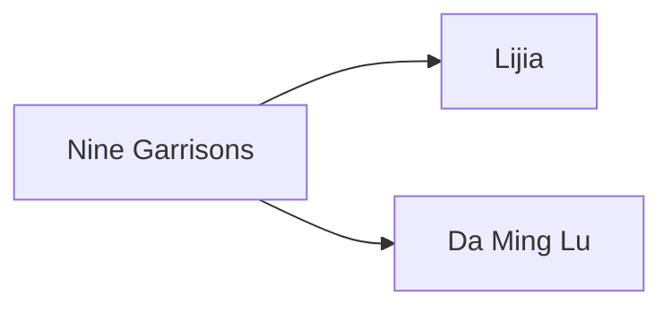

---
tags:
  - Civilization
  - Exploration
  - Vanilla
---

[[Economic]], [[Scientific]]

>*Meaning “the bright,” “beautiful,” or “shining,” the Ming Dynasty radiates at the heart of the world. A vast society, with scholars and bureaucrats, farmers and kings, the Ming concentrates its focus inward, bringing all that is worth having to the center, intensifying its beauty and radiating it outward like the sun. Take up the mantle of the Ming, and shine.*

## Unique Ability
##### *Great Canon of Yongle*
- +50% Science in the Capital
- -2/-15/-25 Science per turn for each Social Policy, but not Tradition slotted in the Government
- +1 Tradition slot

## Unique Infrastructure
##### Improvement: *Ming Great Wall*
- +5 Culture
- +1 Gold Adjacency for Fortification Constructibles
- +1 Tourism
- +6 Combat Strength when defending
- A Road is also placed with each Great Wall Segment
- Can only be built in a line and cannot branch or fork
- Has reduced cost scaling compared to other Unique Improvements

## Unique Units
##### Infantry Unit: *Xunleichong*
- +4 Combat Strength in Featureless tiles
- Has a Ranged attack
##### Merchant: *Maritime Envoy*
- When creating a naval Trade Route, the target player receives +100 Culture (Scales by Game Speed)
- A Treasure Convoy unit worth 1 Cargo spawns for you near the target's border; doubled in value if the target is in Distant Lands

## Civics – Antiquity
##### *Origins*
- Tradition: **Baojia I**
	- +1 Science for each Resource assigned to a Settlement
- +1 Settlement Limit
- +1 Tradition slot
##### *Foundation*
- Attribute Traditions: [[Economic|Merchant Class]] and [[Scientific|Experimentation]]
- Gain 1 Codex
##### *Syncretism*
- Affirmation Tradition: **Chaogong I**
	- +1 Influence for each Resource slotted into your Capital

## Civics – Exploration
##### *Nine Garrisons*
- Improvement: **Ming Great Wall**
- Tradition: **Divine Engine Division**
	- +2 Science in Settlements with a garrisoned Unit
	- +3 Ranged combat strength to Ranged Units adjacent to another Ranged Unit
##### *Lijia*
- Tradition: **Baojia I**
	- +1 Science for each Resource assigned to a Settlement
	- This becomes +2 in Cities other than your Capital
- +1 Settlement Limit
##### *Da Ming Lu*
- Tradition: **Grand Secretariat I**
	- +2 Science on Gold Buildings and +2 Gold on Science Buildings
- Wonder: **Forbidden City**

## Civics – Modern
##### *Modernization*
- Tradition: **Grand Secretariat II**
	- +3 Science on Gold Buildings and +3 Gold on Science Buildings
- +1 Settlement Limit
- +1 Tradition slot
##### *Administration*
- Attribute Traditions: [[Economic|Gold Standard]] and [[Scientific|Location Theory]]
- 
##### *Syncretism*
- Affirmation Tradition: **Chaogong II**
	- +2 Influence for each Resource slotted into your Capital

## Associated Wonder
##### *Forbidden City*
- Unlocked for any Civilization by the *Imperialism II* Civic
- +4 Culture
- +1 Culture and Gold on all Fortification Buildings, Improvements, and Wonders
- +1 Tourism on Fortifications in this Settlement
- Must be placed adjacent to a District

## Age Unlocks
*(available for and grants access to the below for Syncretism and Age Transition)*
- Antiquity
	- [[Han]]
- Modern
	- [[Qing]]
- Leaders
	- [[Confucius]]

## Secondary Unlock
- Improve three Silk
- Have eight Resources slotted in one Settlement

## Starting Biases
- Coast
- Silk

.png/revision/latest)

>*Guided by the stars, the Ming will seize the mandate of heaven, and lead the people into a prosperous future.*

