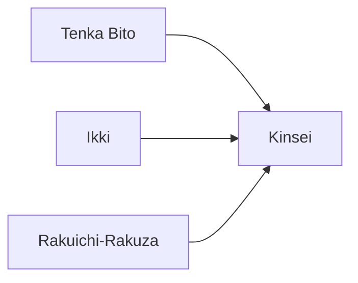

---
tags:
  - Civilization
  - DLC
  - Exploration
---
*Available with the Sengoku Pack DLC*
*Included in the [[Brush and Blade Collection]]*
  

[[Diplomatic]], [[Militaristic]]

>*In Sengoku Japan, power belongs to the bold. In the chaos of conflict, the lowliest ashigaru can rise to the title of samurai, and a minor lord can dream of becoming shogun – provided one survives the storm. The time has come to make a name for yourself.*

## Unique Ability
##### *Shogunate*
- +2/+3/+4 Culture and +2/+3/+4 Science for every Army Commander XP earned in combat
- [Exp/Mod] +1/+2 Influence for every Army Commander XP earned in combat
- Culture Buildings no longer receive an Adjacency with Mountain Terrain
- Science Buildings no longer receive an Adjacency with Resources

## Unique Infrastructure
##### Improvement: *Tea House*
- +2 Food and +2 Happiness
- +1 Culture for each adjacent District
- Must be placed on Flat Terrain not adjacent to another Tea House

## Unique Units
##### Infantry Unit: *Samurai*
- Has Increased Combat Strength
- Does not unlock further tiers in the Tech Tree
- The first time you defeat 3 Units this unit upgrades to the Tier 2, after 3 kills with tier 2 this unit upgrades to Tier 3
##### Civilian Unit: *Shinobi*
- 1 Charge to use Sabotage, which forces an Army Commander to Respawn
- Has the Stealth Ability
- Military Units on the same tile can use the Disperse Shinobi Clan Action to remove these Units

## Civics – Antiquity
##### *Origins*
- Tradition: **Gekokujo I**
	- +50% Army Commander XP
	- But all Buildings have an additional Happiness Maintenance
- +1 Settlement Limit
- +1 Tradition slot
##### *Foundation*
- Attribute Traditions: [[Diplomatic|Emissaries]] and [[Militaristic|Warrior Class]]
- +1 Settlement Limit
##### *Syncretism*
- Affirmation Tradition: **Bushido I**
	- +1 Culture for every Commander Level
	- Army Commanders gain the Old Guard Promotion for free

## Civics – Exploration
##### *Tenka Bito*
- Improvement: **Tea House**
- +1 Tradition slot
##### *Ikki*
- Wonder: **Himeji Castle**
- Tradition: **Gekokujo II**
	- +100% Army Commander XP
	- But all Buildings have an additional Happiness Maintenance
##### *Rakuichi-Rakuza*
- Tradition: **Kabunakama I**
	- +1 Production in all Settlements for each Trade Route it has active
	- +3 Combat Strength to all Land Units
	- -25 Gold in Cities without a Garrisoned Unit
- +1 Tradition slot
##### *Kinsei*
- Tradition: **Daimyo**
	- Land Military Units fight as though they were at full Combat Strength, even when damaged
- Newly trained Samurai are Tier 2
- +2 Settlement Limit

## Civics – Modern
##### *Modernization*
- Tradition: **Kabunakama II**
	- +2 Production in all Settlements for each Trade Route it has active
	- +3 Combat Strength to all Land Units
	- -25 Gold in Cities without a Garrisoned Unit
- +1 Settlement Limit
- +1 Tradition slot
##### *Administration*
- Attribute Traditions: [[Diplomatic|The Great Game]] and [[Militaristic|Force Structuring]]
- +1 Settlement Limit
##### *Syncretism*
- Affirmation Tradition: **Bushido II**
	- +1 Culture and Science for every Commander Level
	- Army Commanders gain the Old Guard Promotion for free

## Associated Wonder
##### *Himeji Castle*
- Unlocked for any Civilization by the *Castles* Technology
- +4 Culture on Fortifications in this Settlement
- +5 Combat Strength for Fortified Districts in all Settlements
- Acts as a Fortified District that must be Conquered
- Must be placed on Rough Terrain

## Age Unlocks
*(available for and grants access to the below for Syncretism and Age Transition)*
- Antiquity
	- [[Achaemenid Persia]]
	- [[Heian Japan]]
- Modern
	- [[Meiji Japan]]
- Leaders
	- [[Himiko, High Shaman]]
	- [[Himiko, Queen of Wa]]
	- [[Toyotomi Hideyoshi]]

## Secondary Unlock
- Be at War with everyone in the Homelands

## Starting Biases
- Grassland

.jpg/revision/latest)

