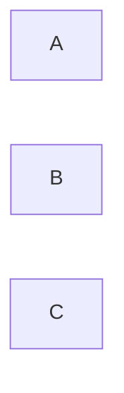

---
tags:
  - Civilization
  - DLC
  - Exploration
  - Unreleased
---
*Available with the Sengoku Pack DLC*
*Included in the [[Brush and Blade Collection]]*
  
  

[[]], [[]]

>**

## Unlocked
- 
- Civilizations
	- 
- Leaders
	- 

## Unique Ability
##### *Shogunate*
- Increased Culture and Science per point of Army Commander XP earned
- [Exp/Mod] Increased Influence per point of Army Commander XP earned
- Culture Buildings no longer receive Adjacencies with Mountains
- Science Buildings no longer receive Adjacencies with Resources

## Unique Infrastructure
##### Infrastructure: **
- 

## Unique Units
##### Unit: **
- 
##### Unit: **
- 

## Civics – Antiquity
##### *Origins*
- Tradition: ****
	- 
- 
##### *Foundation*
- Attribute Traditions: 
- 
##### *Syncretism*
- Affirmation Tradition: ****
	- 

## Civics – Exploration
##### **
- 
- 
- 
##### **
- 
- 
- 
##### **
- 
- 
- 

## Civics – Modern
##### *Modernization*
- Tradition: ****
	- 
- 
##### *Administration*
- Attribute Traditions: 
- 
##### *Syncretism*
- Affirmation Tradition: ****
	- 

## Associated Wonder
##### *Himeji Castle*
- Unlocked for any Civilization by the ** Civic
- 
- 
- 

## Starting Biases
- 
- 

