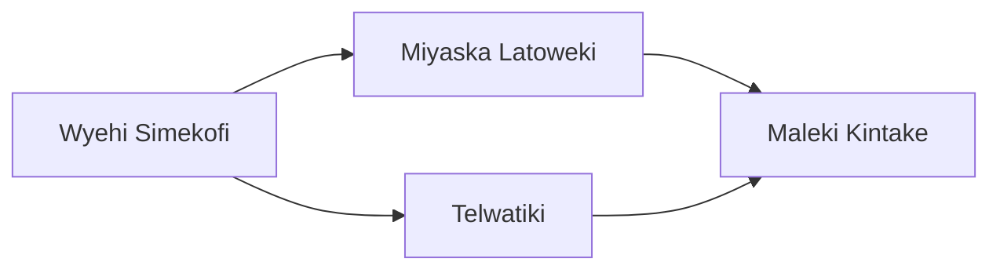

---
tags:
  - Civilization
  - Exploration
  - DLC
---
*Available with the [[Tecumseh and Shawnee Pack]] DLC*

[[Diplomatic]], [[Economic]]

>*The Shawnee are consummate diplomats, who cross leagues on foot to bring together disparate groups even when facing catastrophic odds. Under the watchful eyes of the kispoko, the hoceepkileni call all who will come to the stomp grounds, to hear the orators speak, and to rise together, as one.*

## Unique Ability
##### *Nepekifaki*
- +1/+2/+3 Food on Improvements and Districts on Minor and Navigable River Terrain in Settlements built adjacent to Navigable Rivers
- [Exp/Mod] +1 Resource Capacity in the Capital per City-State you are Suzerain of

## Unique Infrastructure
##### Improvement: *Mawaskawe Skote*
- +4 Food
- +1 Gold for each adjacent Resource
- Must be placed on Vegetated Terrain, and cannot be placed adjacent to another Mawaskawe Skote

## Unique Units
##### Infantry Unit: *Kispoko Nena’to*
- +1 Combat Strength for every unique Empire Resource
##### Missionary: *Hoceepkileni*
- +1 Movement
- Rivers do not end this Unit's Movement

## Civics – Antiquity
##### *Origins*
- Tradition: **Helikhilenawewipe I**
	- +33% Influence towards initiating and progressing the Befriend Independent Project
- +1 Tradition slot
- +1 Settlement Limit
##### *Foundation*
- Attribute Traditions: [[Diplomatic|Emissaries]] and [[Economic|Merchant Class]] 
##### *Syncretism*
- Affirmation Tradition: **Strategic Gifts I**
	- +1 Influence in Cities adjacent to Navigable Rivers
	- +2 Gold per City-State you are Suzerain of

## Civics – Exploration
##### *Wyehi Simekofi*
- Wonder: **Serpent Mound**
- Improvement: **Mawaskawe Skote**
- Tradition: **Bread Dance I**
	- +4 Culture in Farming Towns and +4 Food in Fishing Towns
##### *Miyaska Latoweki*
- Tradition: **Niwiitikeemekonaaki I**
	- +1 Culture in Cities on the Mawaskawe Skote for every City-State you are Suzerain of
- +1 Settlement Limit
##### *Telwatiki*
- Tradition: **Helikhilenawewipe II**
	- +50% Influence towards initiating and progressing the Befriend Independent Project
- +1 Tradition slot
##### *Maleki Kintake*
- Tradition: **Takesiyake Yepepoki**
	- +2 Production on Improvements on Tundra, Desert, and Plains terrain in Cities; these numbers are doubled if the tile is also Navigable River Terrain
- +1 Tradition slot

## Civics – Modern
##### *Modernization*
- Tradition: **Niwiitikeemekonaaki II**
	- +2 Culture in Cities on the Mawaskawe Skote for every City-State you are Suzerain of
- +1 Tradition Slot
- +1 Settlement Limit
##### *Administration*
- Attribute Traditions: [[Diplomatic|The Great Game]] and [[Economic|Gold Standard]]
- Tradition: **Bread Dance II**
	- +8 Culture in Farming Towns and +8 Food in Fishing Towns
##### *Syncretism*
- Affirmation Tradition: **Strategic Gifts II**
	- +2 Influence in Cities adjacent to Navigable Rivers
	- +4 Gold per City-State you are Suzerain of

## Associated Wonder
##### *Serpent Mound*
- Unlocked for any Civilization by the *Astronomy* Technology
- +4 Influence
- +3 Science and +2 Production to all Unique Improvements in this Settlement
- Must be placed in Grassland

## Age Unlocks
*(available for and grants access to the below for Syncretism and Age Transition)*
- Antiquity
	- [[Mississippian]]
- Modern
	- [[America]]
	- [[Mexico]]
- Leaders
	- [[Tecumseh]]

## Secondary Unlock
- Improve three Hides
- Be Suzerain of two City-States

## Starting Biases
- Navigable Rivers

.png/revision/latest)

>*Spring comes to the woodlands. The Shawnee will craft their legacy of unity – and dominance.*

