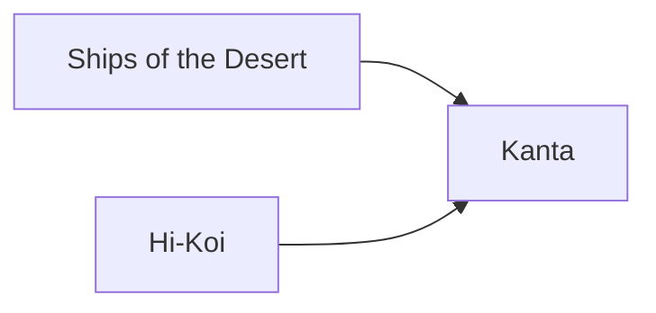

---
tags:
  - Civilization
  - Exploration
  - Vanilla
---
  

[[Economic]], [[Militaristic]]

>*Masters of the rivers and desert alike, the Songhai venture forth into the land. Stirred by the songs of the griot, and driven by their passion for profit and God alike, they seek out the riches of the world. Ride now with them, whether driven on by ambition or virtue, and lay claim to what you can.*

## Unlocked
- Have three Settlements with at least three Navigable River tiles each
- Civilizations
	- [[Aksum]]
	- [[Egypt]]
- Leaders
	- [[Amina]]
	- [[Harriet Tubman]]
	- [[Hatshepsut]]
	- [[Ibn Battuta]]

## Unique Ability
##### *Tarikh al-Sudan*
- +1/+2/+2 Resource Capacity in Cities on Navigable Rivers
- +1/+1/+2 Production in Cities on Navigable Rivers for every Resource assigned to them
- [Exp] Can generate Homelands Treasure Convoys on Navigable Rivers after completing the *Kanta* Civic

## Unique Infrastructure
##### Improvement: *Caravanserai*
- +5 Gold
- +1 Gold Adjacency for Navigable Rivers and Resources
- +1 Trade Range
- Must be placed on Desert or Plains
- Cannot be adjacent to another Caravanserai

## Unique Units
##### Infantry Unit: *Gold Bangles Infantry*
- +5 Combat Strength when fighting on Resources
- +100 Gold (Scales with Game Speed) from pillaging Trade Routes
##### Merchant: *Tajiro*
- Cheaper to train
- When you create a Trade Route receive 200 Gold if this is a Trade Route with at least one Navigable River

## Civics – Antiquity
##### *Origins*
- Tradition: **Wakia I**
	- +2 Gold for every active Trade Route
- Unlocks Merchants
- +1 Settlement Limit
- +1 Tradition slot
##### *Foundation*
- Attribute Traditions: [[Economic|Merchant Class]] and [[Militaristic|Warrior Class]]
- +1 Settlement Limit
##### *Syncretism*
- Affirmation Tradition: **Charismatic Kingship I**
	- +1 Gold on Improvements on Desert Terrain, doubled on Unique Improvements

## Civics – Exploration
##### *Ships of the Desert*
- Improvement: **Caravanserai**
- Wonder: **Tomb of Askia**
- Tradition: **Timbuktu I**
	- +2 Gold on Rough Terrain and Mines on Resources if there is at least 1 Gold Building in that Settlement
- Mastery
	- Tradition: **Mud Brick I**
		- +1 Production on the Caravanserai in Settlements with a Gold Building and in Mining Towns and Trade Outposts
	- +1 Tradition slot
##### *Hi-Koi*
- Tradition: **Isa**
	- +5 Combat Strength and +2 Movement for all Units on Navigable Rivers
	- Minor and Navigable Rivers do not end Unit Movement
- +1 Tradition slot
##### *Kanta*
- Cities in Homelands on Navigable Rivers generate Treasure Convoys worth 2 Cargo each
- Tradition: **Wakia II**
	- +3 Gold for every active Trade Route
- +1 Settlement Limit

## Civics – Modern
##### *Modernization*
- Tradition: Tradition: **Timbuktu II**
	- +3 Gold on Rough Terrain and Mines on Resources if there is at least 1 Gold Building in that Settlement
- +1 Settlement Limit
- +1 Tradition slot
##### *Administration*
- Attribute Traditions: [[Economic|Gold Standard]] and [[Militaristic|Force Structuring]]
- Tradition: **Mud Brick II**
	- +2 Production on the Caravanserai in Settlements with a Gold Building and in Mining Towns and Trade Outposts
- +1 Settlement Limit
##### *Syncretism*
- Affirmation Tradition: **Charismatic Kingship I**
	- +2 Gold on Improvements on Desert Terrain, doubled on Unique Improvements

## Associated Wonder
##### *Tomb of Askia*
- Unlocked for any Civilization by the *Mercantilism* Civic
- +2 Gold
- +2 Resource Capacity in this Settlement
- +2 Gold and +1 Production in this Settlement for every Resource assigned to it
- Must be placed on Desert

## Starting Biases
- Coast
- Navigable Rivers
- Desert
- Plains

.png/revision/latest)

>*From the heart of the Sahel, the Songhai will emerge upon the river's waves to take the world by storm.*

