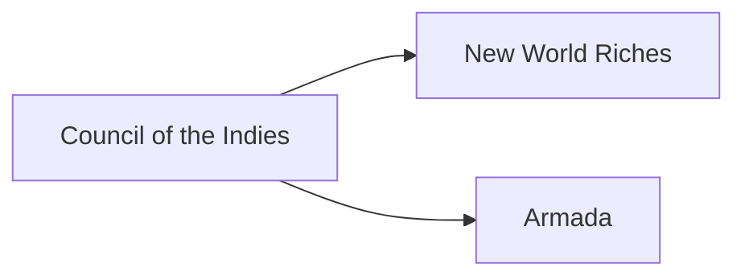

---
aliases:
tags:
  - Civilization
  - Exploration
  - Vanilla
---
  

[[Economic]], [[Militaristic]]

>*The white foam gathers as the galleons set forth, and Spain emerges on the world. As conquistadors set their gaze upon the horizon, a glint arises in their eyes – they sail to claim the world—for glory, for God… or for gold.*

## Unique Ability
##### *Siglo de Oro*
- [Ant] +1 Food, Gold, and Production in Coastal Settlements and in Settlements with an Altar, or +2 if it is both
- [Exp/Mod] +2/+3 Food, Gold, and Production in Settlements adjacent to Coast and in Settlements following your own Religion, or +4/+6 if it is both; doubled in Settlements in Distant Lands
- [Exp/Mod] +15% Gold efficiency towards converting a Town to a City, or +30% in Settlements in Distant Lands

## Unique Infrastructure
##### Quarter: *Plaza*
- +2 Gold in this Settlement for every Settlement in Distant Lands
- Unique Building: **Casa Consistorial**
	- +6 Culture
	- +1 Culture Adjacency for Quarters and Wonders
	- Must be built in the Homelands adjacent to Coast.
- Unique Building: **Casa de Contratación**
	- +6 Gold
	- +1 Gold Adjacency for Navigable Rivers, Resources, and Wonders
	- Must be built in the Homelands adjacent to Coast.

## Unique Units
##### Infantry Unit: *Tercio*
- Has a higher Combat Strength
- Adjacent Units receive +3 Combat Strength against Cavalry Units (bonus is only applied once)
##### Great Person: *Conquistador*
- Can only be trained in Cities with a Plaza
- Can only be activated in Distant Lands
- Can always embark in Ocean
- **Álvar Núñez Cabeza de Vaca**: Activate on or adjacent to a Natural Wonder; gain 200 Gold for each Natural Wonder tile here or adjacent (on Standard Speed)
- **Christopher Columbus**: Activate on any Water tile to reveal the map except for the interior of Distant Lands
- **Ferdinand Magellan**: Activate on a Fleet Commander, the Commander receives +2 Movement and +2 Sight
- **Francisco de Orellana**: Activate on a Navigable River tile to receive 50 Gold for every tile of that River (on Standard Speed)
- **Francisco Pizarro**: Activate on an Army Commander with 3 empty slots, the Commander receives 2 Infantry Units and 1 Cavalry Unit
- **Hernán Cortés**: Activate on an Army Commander with enough empty slots, the Commander receives Infantry Units
- **Hernando de Soto**: Activate on a tile owned by an Independent Power; this Independent Power becomes a City-State with you as the Suzerain
- **Inés Suárez**: Activated on an eligible Settlement location to create a new Town
- **Juan Ponce de León**: Activate on any Water tile; +1 Movement for Treasure Fleets
- **Miguel López de Legazpi**: Activate on an Army Commander with 3 empty slots; this Commander receives 2 Ranged Units and 1 Infantry Unit

## Civics – Antiquity
##### *Origins*
- Tradition: **Cerro Rico I**
	- +1 Gold on Resources
- +1 Settlement Limit
- +1 Tradition slot
##### *Foundation*
- Attribute Traditions: [[Economic|Merchant Class]] and [[Militaristic|Warrior Class]] 
- +1 Settlement Limit
##### *Syncretism*
- Affirmation Tradition: **Corregidor I**
	- +2 Gold on Districts on or adjacent to Coast

## Civics – Exploration
##### *Council of the Indies*
- Building: **Casa Consistorial**
- Building: **Casa de Contratación**
- Mastery
	- Tradition: **Conquista**
		- +3 Combat Strength for all Units in Distant Lands, or +5 Combat Strength for Naval Units
	- Wonder: **El Escorial**
	- +1 Settlement Limit
##### *New World Riches*
- Tradition: **Cerro Rico II**
	- +1 Gold on Resources, or +3 in Distant Lands
- +1 Movement for Treasure Convoys
- Gold and Silver Resources are worth +1 Cargo for Treasure Convoys
- +1 Tradition slot
##### *Armada*
- Tradition: **Great and Most Fortunate Navy I**
	- +50% Production towards training Naval Units
	- Fleet Commanders gain the Flotilla Promotion for free
- +1 Tradition slot

## Civics – Modern
##### *Modernization*
- Tradition: **Great and Most Fortunate Navy II**
	- +100% Production towards training Naval Units
	- Fleet Commanders gain the Flotilla Promotion for free
- +1 Settlement Limit
- +1 Tradition slot
##### *Administration*
- Attribute Traditions: [[Economic|Gold Standard]] and [[Militaristic|Force Structuring]]
- +1 Settlement Limit
##### *Syncretism*
- Affirmation Tradition: **Corregidor II**
	- +2 Gold on Districts on or adjacent to Coast
	- +10% Food and Production in Cities in Distant Lands

## Associated Wonder
##### *El Escorial*
- Unlocked for any Civilization by the *Colonialism II* Civic
- +3 Happiness
- Has 3 Great Work slots
- +1 Settlement Limit
- +4 Happiness on Cities within 7 tiles of this Wonder
- Must be placed on Rough Terrain

## Age Unlocks
*(available for and grants access to the below for Syncretism and Age Transition)*
- Antiquity
	- [[Carthage]]
	- [[Greece]]
	- [[Rome]]
- Modern
	- [[Mexico]]
- Leaders
	- [[Augustus]]
	- [[Benjamin Franklin]]
	- [[Charlemagne]]
	- [[Edward Teach]]
	- [[Friedrich, Baroque]]
	- [[Friedrich, Oblique]]
	- [[Isabella]]
	- [[Lafayette]]
	- [[Machiavelli]]
	- [[Napoleon, Emperor]]
	- [[Napoleon, Revolutionary]]
	- [[Simón Bolívar]]

## Secondary Unlock
- Reconquer a lost Settlement

## Starting Bias
- Coast

.jpg/revision/latest)

>*Undaunted by the ocean's expanse, Spain will follow the song of gold to unknown lands and make them its own.*

