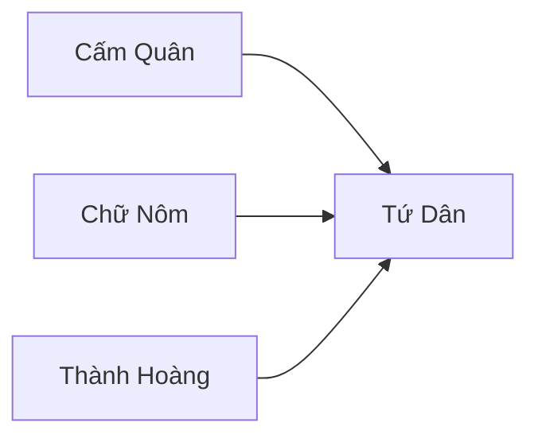

---
tags:
  - Civilization
  - Exploration
  - DLC
aliases:
---
*Available with the Dai Viet Pack DLC*
*Included in the [[Right to Rule Collection]]*

[[Cultural]], [[Expansionist]]

>*Through the shadow of war and oppression, the people of Đại Việt remain strong. Toiling in the rice field or on elephant-back, the Vietnamese people yearn for their right to determine their own destiny, and to push back would-be invaders to their own shores – or to make conquests of their own. With the beat of the trong com and the trumpeting of elephants, Đại Việt stakes its claim.*

## Unique Ability
##### *Hịch Tướng Sĩ*
- When you create a Fortification Building or Wonder, gain 15/25/35 Culture for each Urban Population in the Settlement
- +1/+2/+2 Culture and Food on Fortification Constructibles in Tropical Terrain

## Unique Infrastructure
##### Improvement: *Water Puppet Theater*
- +4 Food
- +2 Happiness if placed on Floodplains
- +1 Culture for every time a Storm, Flood, or Volcanic Eruption has provided Fertility to this Settlement this Age
- Improvements, Buildings, and Districts in this Settlement do not get pillaged by Floods
- Must be placed adjacent to a River not adjacent to another Water Puppet Theater

## Unique Units
##### Ranged Unit: *Voi Chiến*
- Has increased cost, Combat Strength, +1 Sight, and +1 Movement
- Can move after attacking
##### Settler: *Quận Vương*
- When this Unit creates a Town, gain 25 Culture for every Tropical Terrain within 3 tiles of the City Center (Scales by Game Speed)

## Civics – Antiquity
##### *Origins*
- Tradition: **Cấm Binh I**
	- +1 Gold on Fortifications
	- +50% Production towards constructing Fortification Constructibles
- +1 Tradition slot
- +1 Settlement Limit
##### *Foundation*
- Attribute Traditions: [[Cultural|Enlightened Rule]] and [[Expansionist|Fractal Cities]]
- Wonder: **Pyramid of the Sun**
- +1 Settlement Limit
##### *Syncretism*
- Affirmation Tradition: **Hành Chính Công I**
	- +1 Culture on Improvements and Districts on Vegetation in Tropical Terrain

## Civics – Exploration
##### *Cấm Quân*
- Wonder: **Thành Huế**
	- Combat Units receive +3 Combat Strength during Formal Wars, this is doubled in your territory
- Tradition: **Cấm Binh II**
	- +2 Gold on Fortifications
	- +50% Production towards constructing and Gold towards purchasing Fortification Constructibles
##### *Chữ Nôm*
- Tradition: **Con Kênh**
	- Culture and Food Buildings gain a +1 Culture Adjacency for Tropical Terrain
- Gain 1 Relic
##### *Thành Hoàng*
- Improvement: **Water Puppet Theater**
- +2 Tradition slots
##### *Tứ Dân*
- Tradition: **Ruộng Làng Xã I**
	- +1 Food on Farms, Plantations, and Fortifications in Towns in Tropical Terrain
	- +5 Combat Strength for Fortified Districts and Land Units in friendly territory
- +1 Settlement Limit

## Civics – Modern
##### *Modernization*
- Tradition: **Ruộng Làng Xã II**
	- +2 Food on Farms, Plantations, and Fortifications in Towns in Tropical Terrain
	- +5 Combat Strength for Fortified Districts and Land Units in friendly territory
- +1 Tradition slot
- +1 Settlement Limit
- +1 Artifact
##### *Administration*
- Attribute Traditions: [[Cultural|Romanticism]] and [[Expansionist|Industrial Agriculture]]
- Wonder: **Taj Mahal**
- +1 Settlement Limit
##### *Syncretism*
- Affirmation Tradition: **Hành Chính Công II**
	- +1 Culture and Food on Improvements and Districts on Vegetation in Tropical Terrain

## Associated Wonder
##### *Thành Huế*
- Unlocked for any Civilization by the *Castles* Technology
- +4 Culture
- +1 Specialist Limit in Cities with 7 Fortification Constructibles
- Acts as a Fortified District
- Must be built adjacent to Medieval Walls, in a City with 7 Medieval Walls

## Age Unlocks
*(available for and grants access to the below for Syncretism and Age Transition)*
- Antiquity
	- [[Khmer]]
- Modern
	- [[Siam]]
- Leaders
	- [[Lakshmibai]]
	- [[Trung Trac]]

## Secondary Unlock
- Have three Settlements on Tropical

## Starting Biases
- Floodplains
- Tropical

.png/revision/latest)

