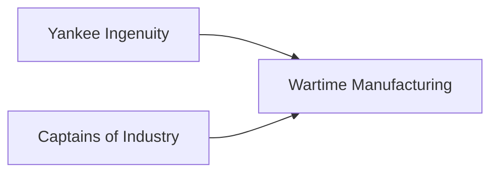

---
aliases:
tags:
  - Civilization
  - Modern
  - Vanilla
---
  

[[Economic]], [[Expansionist]]

>*Built on steam, on iron, and on a vision that looks relentlessly ahead, America surges forward. The brave new world unrolls from factory assembly lines, on rail tracks that extend across the plains, and in the eyes of each immigrant who sets foot upon its shores. Come, and dream anew, under the stars and stripes.*

## Unlocked
- Have three Distant Lands Settlements in either Plains or Grasslands
- Civilizations
	- [[Rome]]
	- [[Iceland]]
	- [[Norman]]
	- [[Shawnee]]
- Leaders
	- [[Benjamin Franklin]]
	- [[Harriet Tubman]]
	- [[Lafayette]]
	- [[Pachacuti]]
	- [[Tecumseh]]

## Unique Ability
##### *Frontier Expansion*
- Gain 100 Gold every time you improve a Resource

## Civic Tree
##### *Yankee Ingenuity*
- Unlocks the **Steel Mill** Unique Building
- Unlocks the **Gold Rush** Tradition
	- +3 Gold on Resources
- Mastery
	- Whenever you train a Prospector or Marine, receive an additional one
##### *Captains of Industry*
- Unlocks the **Railyard** Unique Building
- Unlocks the **Robber Baron** Tradition
	- +1 Influence in Cities for every Resource assigned to them
- Mastery
	- +1 Production on Resources
	- +1 Settlement Limit
##### *Wartime Manufacturing*
- Units receive +3 Combat Strength for having more than one adjacent enemy Unit
- Unlocks the **Statue of Liberty** Wonder
- Mastery
	- +25% Production towards Military Units when fighting a war in which your War Support is higher than your opponent
	- Unlocks the **Lend-Lease** Tradition
		- +5 Gold and +1 Influence for every Trade Route

## Unique Military Unit
##### *Marine*
- Unique Infantry Unit
- Has the Amphibious ability
- Cheaper to train

## Unique Civilian Unit
##### *Prospector*
- Unique Civilian Unit
- Claims a Land Resource outside of your regular Settlement radius

## Unique Infrastructure
##### *Industrial Park*
- Unique Quarter
- Increases the number of Resources that may be assigned to this Settlement by 2
- Unique Building: **Railyard**
	- +9 Production
	- +1 Production Adjacency for Quarters and Wonders
- Unique Building: **Steel Mill**
	- +9 Production
	- +1 Gold Adjacency for Resources and Wonders

## Associated Wonder
##### *Statue of Liberty*
- +6 Happiness
- Spawns 4 Migrant Units
- Must be placed on Coast adjacent to land

## Starting Biases
- Rough
- Rivers

>*From the fertile soil of America springs forth a brave new world, driven by passion, ideas, and a desire to shape the future.*
