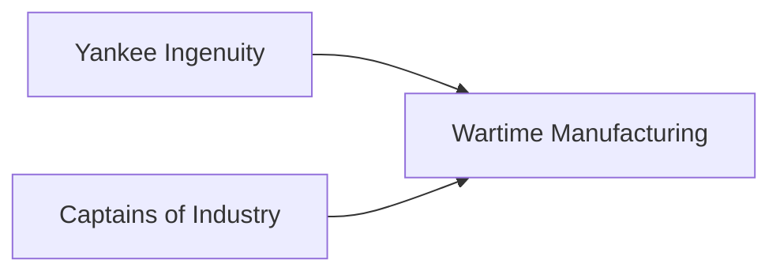

---
aliases:
tags:
  - Civilization
  - Modern
  - Vanilla
---
  

[[Economic]], [[Diplomatic]]

>*Built on steam, on iron, and on a vision that looks relentlessly ahead, America surges forward. The brave new world unrolls from factory assembly lines, on rail tracks that extend across the plains, and in the eyes of each immigrant who sets foot upon its shores. Come, and dream anew, under the stars and stripes.*

## Unlocked
- Have three Distant Lands Settlements in either Plains or Grasslands
- Civilizations
	- [[Rome]]
	- [[Iceland]]
	- [[Norman]]
	- [[Shawnee]]
- Leaders
	- [[Benjamin Franklin]]
	- [[Harriet Tubman]]
	- [[Lafayette]]
	- [[Pachacuti]]
	- [[Tecumseh]]

## Unique Ability
##### *Frontier Expansion*
- Gain 50/100/150 Gold every time you improve a Resource
- +1 Production on Resources

## Civic Tree
## Unique Infrastructure
##### Quarter: *Industrial Park*
- +1 GDP from Factory Resources assigned to this Settlement
- Building: **Railyard**
	- +9 Production
	- +1 Production Adjacency for Quarters and Wonders
- Building: **Steel Mill**
	- +9 Production
	- +1 Gold Adjacency for Resources and Wonders

## Unique Units
##### Infantry Unit: *Marine*
- Has the Amphibious ability
- Cheaper to train
##### Civilian Unit: *Prospector*
- Activate on an unowned Land Resource within 5 tiles of your regular Settlement radius; a path of tiles is claimed back to the Settlement and the Resource is improved immediately

## Civics – Antiquity
##### *Origins*
- Tradition: Tradition: **Gold Rush I**
	- +1 Gold in Settlements for every Resource assigned to them
- +1 Settlement Limit
- +1 Tradition slot
##### *Foundation*
- Attribute Traditions: [[Diplomatic|Emissaries]] and [[Economic|Merchant Class]]
##### *Syncretism*
- Affirmation Tradition: **Land of Opportunity I**
	- +1 Food on Resources in Towns

## Civics – Exploration
##### *Renaissance*
- Tradition: Tradition: **Robber Baron I**
	- +1 Influence in the Capital for every Resource assigned to it
- +1 Settlement Limit
- +1 Tradition slot
##### *Hierarchy*
- Attribute Traditions: [[Diplomatic|Spy Network]] and [[Economic|Supply and Demand]]
##### *Syncretism*
- Affirmation Tradition: **Land of Opportunity II**
	- +1 Food on Resources in Towns
	- +1 Production on Mines, Clay Pits, Quarries, Woodcutters, and Oil Rigs in Mining Towns

## Civics – Modern
##### *Yankee Ingenuity*
- +1 Tradition slot
- Building: **Steel Mill**
- Tradition: **Gold Rush II**
	- +4 Gold in Settlements for every Resource assigned to them
##### *Captains of Industry*
- +1 Tradition slot
- Building: **Railyard**
- Tradition: **Robber Baron II**
	- +1 Influence in Cities for every Resource assigned to them
##### *Wartime Manufacturing*
- Tradition: **Lend-Lease**
	- +1 War Support on all Wars, or +2 if joining a War with an Ally
	- +25% Production towards training Military Units when fighting a War in which your War Support is higher than your opponent
- Wonder: **Statue of Liberty**
- +1 Settlement Limit

## Associated Wonder
##### *Statue of Liberty*
- +6 Happiness
- Spawns 4 Migrants
- Must be placed on Coast adjacent to land

## Starting Biases
- Rough
- Rivers

>*From the fertile soil of America springs forth a brave new world, driven by passion, ideas, and a desire to shape the future.*
