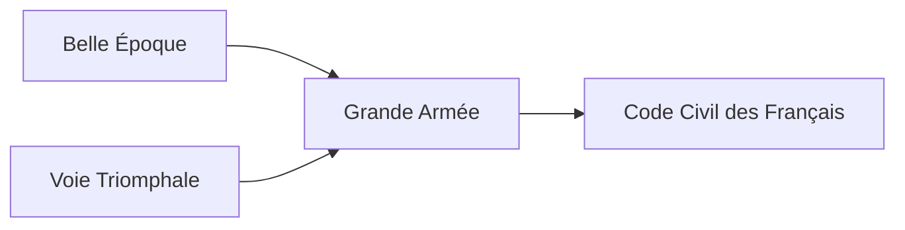

---
aliases:
tags:
  - Civilization
  - Modern
  - Vanilla
---

[[Cultural]], [[Diplomatic]]

>*The spark of revolution catches, and France is born. Standing in defiance of the right of kings, the French people choose a future governed by science and learning, provided that the old ways pass first through the guillotine. Bring the Revolution's promise of a more just world, or resurrect the specters of autocracy.*

## Unlocked
- Improve three Wine
- Civilizations
	- [[Rome]]
	- [[Norman]]
	- [[Republic of Pirates]]
- Leaders
	- [[Alexander the Great]]
	- [[Augustus]]
	- [[Benjamin Franklin]]
	- [[Charlemagne]]
	- [[Edward Teach]]
	- [[Friedrich, Baroque]]
	- [[Friedrich, Oblique]]
	- [[Gilgamesh]]
	- [[Isabella]]
	- [[Lafayette]]
	- [[Machiavelli]]
	- [[Napoleon, Emperor]]
	- [[Napoleon, Revolutionary]]
	- [[Simón Bolívar]]

## Unique Ability
##### *Liberté, Egalité, Fraternité*
- You can select the Celebration effects of any standard current Age Government

## Unique Infrastructure
##### Quarter: *Avenue*
- +2 Happiness on Quarters in this City
- Building: **Jardin à la Française**
	- +9 Culture
	- +1 Happiness Adjacency for Culture Buildings and Wonders
- Building: **Salon**
	- +9 Happiness
	- +1 Culture Adjacency for Happiness Buildings and Wonders

## Unique Units
##### Infantry Unit: *Garde Impériale*
- Can make a Ranged attack
- +2 Combat Strength when adjacent to a friendly Army Commander
- More expensive to train
##### Great Person: *Jacobin*
- Can only be trained in Cities with an Avenue
- **Camille Desmoulins**: Activate on any City's District to add +1 Happiness on Quarters in that City
- **Etta Palm D'Aelders**: Activated on a Palace or a City Hall to add a large amount of Happiness to it
- **Georges Danton**: Activate on a Palace to immediately trigger a Celebration
- **Jacques Nicolas Billaud-Varenne**: Activate on the Palace to grant all Land Units +3 Combat Strength in Districts
- **Jacques Pierre Brissot**: Activate on the Palace to grant all Units +2 Combat Strength
- **Jean-Paul Marat**: Activate on the Palace to add +1 Culture on Quarters
- **Louis Antoine de Saint-Just**: Activate on an Army Commander to change its name to **Archangel of the Terror**; Units within this Command Radius gain +4 Combat Strength
- **Maximilien Robespierre**: Activate on the Palace to unlock a unique Tradition, **Reign of Terror**
	- +3 Culture on Quarters, but -25% Growth Rate in Cities
- **Olympe de Gouges**: Activate on the Palace to add +1 Science on Quarters
- **Paul Barras**: Activate on the Palace to increase all Support effects from Diplomatic Actions by 10%

## Civics – Antiquity
##### *Origins*
- Tradition: **Style Empire I**
	- Constructing a Building grants Culture equal to 15% of its Production cost
	- +2 Culture on Happiness Buildings and Wonders
- +1 Settlement Limit
- +1 Tradition slot
##### *Foundation*
- Attribute Traditions: [[Cultural|Enlightened Rule]] and [[Diplomatic|Priestly Class]]
- Wonder: **Pyramid of the Sun**
##### *Syncretism*
- Affirmation Tradition: **De l'Esprit des Loix I**
	- +2 Culture for every Tradition slotted into the Government
	- +2 Happiness for every Social Policy slotted into the Government

## Civics – Exploration
##### *Renaissance*
- Tradition: **Cocorico I**
	- When you defeat an enemy Unit, gain Culture equal to 15% of its Combat Strength
	- +2 Happiness on Military Buildings and Wonders
- +1 Settlement Limit
- +1 Tradition slot
##### *Hierarchy*
- Attribute Traditions: [[Cultural|Classical Revival]] and [[Diplomatic|Jubilee]]
- Wonder: **Notre Dame**
##### *Syncretism*
- Affirmation Tradition: **De l'Esprit des Loix I**
	- +3 Culture for every Tradition slotted into the Government
	- +3 Happiness for every Social Policy slotted into the Government

## Civics – Modern
##### *Belle Époque*
- Building: **Salon**
- Tradition: **Style Empire II**
	- Constructing a Building grants Culture equal to 25% of its Production cost
	- +2 Culture on Happiness Buildings and Wonders
##### *Voie Triomphale*
- Building: **Jardin à la Française**
- Tradition: **Cocorico II**
	- When you defeat an enemy Unit, gain Culture equal to 25% of its Combat Strength
	- +2 Happiness on Military Buildings and Wonders
##### *Grande Armée*
- Tradition: **Bataillon-Carré**
	- Infantry Units gain the Swift ability, allowing them to ignore Zone of Control
- +1 Settlement Limit
- +1 Tradition slot
##### *Code Civil des Français*
- Wonder: **Eiffel Tower**
- +1 Tradition slot

## Associated Wonder
##### *Eiffel Tower*
- Unlocked for any Civilization by the *Radio* Technology
- +5 Culture
- +4 Culture and +2 Tourism on Quarters in this City
- Must be built adjacent to a District

## Starting Bias
- Wine

.jpg/revision/latest)

>*France looks out upon an incomplete world—a blank canvas waiting to be marked.*

