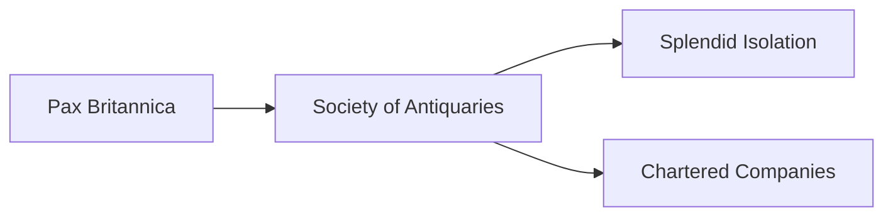

---
aliases:
tags:
  - Civilization
  - Modern
  - DLC
---
*Available with the Great Britain Pack DLC*
*Included in the [[Crossroads of the World Collection]]*

  

[[Economic]], [[Expansionist]]

>*Rule, Britannia! Beyond the smoky London skies, beyond the churn of Manchester's mills, there is a greater glory – the Empire. Ever-hungry mills demand feeding, and ever-full warehouses demand markets. Heed their call, and may the sun never set upon your dominion.*

## Unlocked
- Have two Fleet Commanders
- Civilizations
	- [[Rome]]
	- [[Norman]]
- Leaders
	- [[Ada Lovelace]]
	- [[Benjamin Franklin]]
	- [[Edward Teach]]

## Unique Ability
##### *Workshop of the World*
- +25% Gold towards purchasing Buildings and 25% Production towards producing Buildings
- It costs 50% more to Convert Towns into Cities

## Unique Infrastructure
##### Quarter: *Financial Centre*
- +2 Gold and Science for every connected Settlement
- Building: **Royal Exchange**
	- +9 Gold
	- +1 Gold adjacency for Quarters and Wonders
- Building: **Manufactory**
	- +9 Production
	- +1 Production Adjacency for Resources and Wonders
	- +1 Gold Adjacency for Navigable Rivers

## Unique Units
##### Heavy Naval Unit: *Revenge*
- Enemy Units in tiles adjacent to the target take 25% of the total damage done to the target
##### Explorer: *Antiquarian*
- +20 Culture for every tile from your Capital when you use Excavate Artifact

## Civics – Antiquity
##### *Origins*
- Tradition: ****
	- 
- 
##### *Foundation*
- Attribute Traditions: 
- 
##### *Syncretism*
- Affirmation Tradition: ****
	- 

## Civics – Exploration
##### *Renaissance*
- Tradition: ****
	- 
- 
##### *Hierarchy*
- Attribute Traditions: 
- 
##### *Syncretism*
- Affirmation Tradition: ****
	- 

## Civics – Modern
##### *Pax Britannica*
- Unlocks the **Royal Exchange** Unique Building
- +3 Production in Settlements for every Factory Resource assigned to them
- Mastery
	- Unlocks the **Manufactory** Unique Building
	- Unlocks the **Battersea Power Station** Wonder
##### *Society of Antiquaries*
- Unlocks the **Proceedings** Tradition
	- +4 Culture and Science in Cities with both a Great Work and a Resource slotted 
- +1 Movement for Civilians
##### *Splendid Isolation*
- +3 Combat Strength for Units if you have positive or 0 Gold per turn at the start of the turn
- Unlocks the **No Eternal Allies** Tradition
	- +10% Food and Gold in Towns, but -5% Gold in the Capital for every Alliance
- +1 Settlement Limit
##### *Chartered Companies*
- Unlocks the **East India Company** Tradition
	- +5 Gold in Towns
- +1 Resource Capacity in Settlements with a Port

## Associated Wonder
##### *Battersea Power Station*
- +4 Production
- Receive a second Naval Unit each time you train a Naval Unit 
- Must be placed on land adjacent to Coast

>*Chaos is the absence of order, and the world needs structure. Great Britain ascends.*
