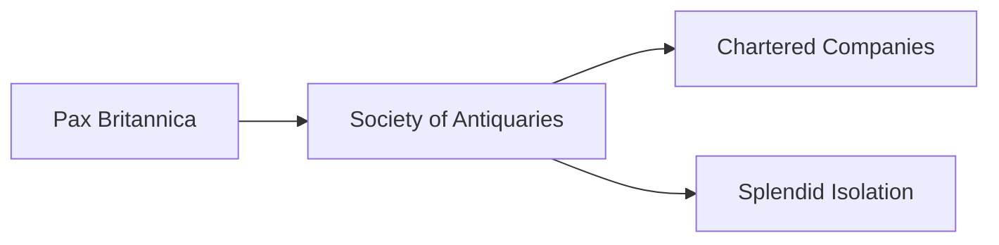

---
aliases:
tags:
  - Civilization
  - Modern
  - DLC
---
*Available with the Great Britain Pack DLC*
*Included in the [[Crossroads of the World Collection]]*

  

[[Economic]], [[Scientific]]

>*Rule, Britannia! Beyond the smoky London skies, beyond the churn of Manchester's mills, there is a greater glory – the Empire. Ever-hungry mills demand feeding, and ever-full warehouses demand markets. Heed their call, and may the sun never set upon your dominion.*

## Unlocked
- Have two Fleet Commanders
- Civilizations
	- [[Rome]]
	- [[Norman]]
	- [[Republic of Pirates]]
- Leaders
	- [[Ada Lovelace]]
	- [[Benjamin Franklin]]
	- [[Edward Teach]]

## Unique Ability
##### *Workshop of the World*
- +25% Gold towards purchasing Buildings and +25% Production towards constructing Buildings
- It costs 50% more to Convert Towns into Cities
- +1/+2/+3 Science on Active Building adjacent to Coast

## Unique Infrastructure
##### Quarter: *Financial Centre*
- +2 Gold and Science for every connected Settlement
- Building: **Royal Exchange**
	- +9 Gold
	- +1 Gold adjacency for Quarters and Wonders
- Building: **Manufactory**
	- +9 Production
	- +1 Production Adjacency for Resources and Wonders
	- +1 Gold Adjacency for Navigable Rivers

## Unique Units
##### Heavy Naval Unit: *Revenge*
- +5 Combat, Ranged, and Bombard Strength
- Enemy Units in tiles adjacent to the target take 25% of the total damage done to the target
##### Explorer: *Antiquarian*
- +20 Culture for every tile from your Capital when you use Excavate Artifact

## Civics – Antiquity
##### *Origins*
- Tradition: **East India Company I**
	- +2 Gold in Towns
	- +1 Science in Towns adjacent to Coast
- +1 Settlement Limit
- +1 Tradition slot
##### *Foundation*
- Attribute Traditions: [[Economic|Merchant Class]] and [[Scientific|Experimentation]]
- Gain 1 Codex
##### *Syncretism*
- Affirmation Tradition: **Royal Society I**
	- +1 Science on Culture Buildings adjacent to Coast
	- +1 Culture on Science Buildings adjacent to Coast

## Civics – Exploration
##### *Renaissance*
- Tradition: **No Eternal Allies I**
	- +5% Food and Gold in Towns, but -5% Gold in the Capital for every Alliance
- +1 Settlement Limit
- +1 Tradition slot
##### *Hierarchy*
- Attribute Traditions: [[Economic|Supply and Demand]] and [[Scientific|Alchemy]]
##### *Syncretism*
- Affirmation Tradition: **Royal Society II**
	- +2 Science on Culture Buildings adjacent to Coast
	- +2 Culture on Science Buildings adjacent to Coast

## Civics – Modern
##### *Pax Britannica*
- Wonder: **Battersea Power Station**
- Building: **Royal Exchange**
- Building: **Manufactory**
- +1 Tradition slot
##### *Society of Antiquaries*
- Tradition: **Proceedings**
	- +4 Culture and Science in Cities with both a Great Work and a Resource slotted 
	- Settlements receive +3 Production for each Factory Resource assigned to them
- Gain 1 Artifact
##### *Chartered Companies*
- Tradition: **East India Company II**
	- +5 Gold in Towns
	- +3 Science in Towns adjacent to Coast
- +1 Tradition slot
##### *Splendid Isolation*
- Tradition: **No Eternal Allies II**
	- +10% Food and Gold in Towns, but -5% Gold in the Capital for every Alliance
- +1 Settlement Limit

## Associated Wonder
##### *Battersea Power Station*
- Unlocked for any Civilization by the *Electricity II* Technology
- +4 Production
- Receive a second Naval Unit each time you train a Naval Unit 
- Must be placed on land adjacent to Coast

>*Chaos is the absence of order, and the world needs structure. Great Britain ascends.*
