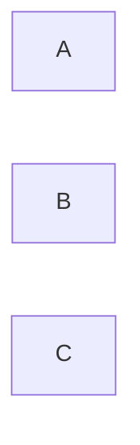

---
tags:
  - Civilization
  - DLC
  - Modern
  - Unreleased
---
*Available with the Joseon Pack DLC*
*Included in the [[Brush and Blade Collection]]*
  
  

[[]], [[]]

>**

## Unlocked
- 
- Civilizations
	- 
- Leaders
	- 

## Unique Ability
##### **
- 

## Unique Infrastructure
##### Infrastructure: **
- 

## Unique Units
##### Unit: **
- 
##### Unit: **
- 

## Civics – Antiquity
##### *Origins*
- Tradition: ****
	- 
- 
##### *Foundation*
- Attribute Traditions: 
- 
##### *Syncretism*
- Affirmation Tradition: ****
	- 

## Civics – Exploration
##### *Renaissance*
- Tradition: ****
	- 
- 
##### *Hierarchy*
- Attribute Traditions: 
- 
##### *Syncretism*
- Affirmation Tradition: ****
	- 

## Civics – Modern
##### **
- 
- 
- 
##### **
- 
- 
- 
##### **
- 
- 
- 

## Associated Wonder
##### **
- 
- 
- 

## Starting Biases
- 
- 

