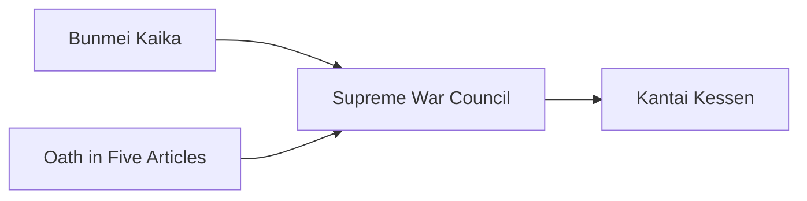

---
aliases:
tags:
  - Civilization
  - Modern
  - Vanilla
---
  

[[Militaristic]], [[Scientific]]

>*As isolated Japan turns outward, the Meiji Dynasty heralds a new beginning. Embracing a world it once shut out, the Meiji streets blend kimonos with top hats, under the glare of electric lights. A new dawn breaks; the world will see what Japan has to offer.*

## Unlocked
- Improve three Tea
- Civilizations
	- [[Khmer]]
	- [[Hawai'i]]
	- [[Majapahit]]
- Leaders
	- [[Himiko, Queen of Wa|Himiko]]
	- [[José Rizal]]
	- [[Trung Trac]]

## Unique Ability
##### *Goisshin*
- When you Overbuild a Building, gain Science equal to 50% of the Building's Production cost

## Unique Infrastructure
##### Quarter: *Zaibatsu*
- +1 Gold and Production on Buildings in adjacent Districts
- Increases the number of resources that may be assigned to this Settlement by 1
- Building: **Ginkō**
	- +9 Gold
	- +1 Gold Adjacency for Gold Buildings and Wonders
- Building: **Jukogyo**
	- +9 Production
	- +1 Production Adjacency for Coastal Terrain and Wonders

## Unique Units
##### Heavy Naval Unit: *Mikasa*
- The first time this Unit is destroyed, it respawns in the closest Settlement you own at 50% HP
##### Fighter Air Unit: *Zero*
- Increased range
- +4 Combat Strength against other Fighter Air Units

## Civics – Antiquity
##### *Origins*
- Tradition: ****
	- 
- 
##### *Foundation*
- Attribute Traditions: 
- 
##### *Syncretism*
- Affirmation Tradition: ****
	- 

## Civics – Exploration
##### *Renaissance*
- Tradition: ****
	- 
- 
##### *Hierarchy*
- Attribute Traditions: 
- 
##### *Syncretism*
- Affirmation Tradition: ****
	- 

## Civics – Modern
##### *Bunmei Kaika*
- Unlocks the **Jukogyo** Unique Building
- +50% Production towards constructing Military and Production Buildings
- Unlocks the **Fukoku Kyōhei** Tradition
	- When you train an Aircraft or Naval Unit, receive Science equal to 25% of its Production cost
- Unlocks the **Dogo Onsen** Wonder
##### *Oath in Five Articles*
- Unlocks the **Ginkō** Unique Building
- +50% Production towards constructing Science Buildings
- Unlocks the **O-yatoi Gaikokujin** Tradition
	- +1 Production and Science from Specialists
##### *Supreme War Council*
- +25% Production towards training Naval and Aircraft Units
- Unlocks the **Shusei Kokubō** Tradition
	- Military Buildings receive a +1 Production Adjacency from Coast
##### *Kantai Kessen*
- +3 Combat Strength for Units on or adjacent to Coast
- Unlocks the **Kōkūtai** Tradition
	- +6 Combat Strength for Aircraft attacking an enemy Unit engaged by a Naval Unit

## Associated Wonder
##### *Dogo Onsen*
- +4 Happiness
- This Settlement gains a Population every time you enter a Celebration
- Must be placed adjacent to Coast

## Starting Biases
- Coast
- Grassland

>*The sun rises. The Meiji ascend.*
