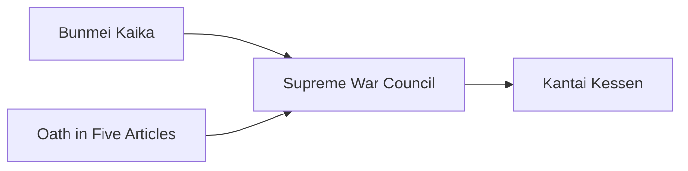

---
aliases:
tags:
  - Civilization
  - Modern
  - Vanilla
---

[[Militaristic]], [[Scientific]]

>*As isolated Japan turns outward, the Meiji Dynasty heralds a new beginning. Embracing a world it once shut out, the Meiji streets blend kimonos with top hats, under the glare of electric lights. A new dawn breaks; the world will see what Japan has to offer.*

## Unique Ability
##### *Goisshin*
- [Ant] When you construct a Building, gain Science equal to 25% of the Building's Production cost
- [Exp/Mod] When you Overbuild a Building, gain Science equal to 25% of the Building's Production cost

## Unique Infrastructure
##### Quarter: *Zaibatsu*
- +1 Gold and Production on Buildings in adjacent Districts
- +1 Resource Capacity in this Settlement
- Building: **Ginkō**
	- +9 Gold
	- +1 Gold Adjacency for Gold Buildings and Wonders
- Building: **Jukogyo**
	- +9 Production
	- +1 Production Adjacency for Coastal Terrain and Wonders

## Unique Units
##### Heavy Naval Unit: *Mikasa*
- The first time this Unit is destroyed, it respawns in the closest Settlement you own at 50% HP
##### Fighter Air Unit: *Zero*
- Increased range
- +4 Combat Strength against other Fighter Air Units

## Civics – Antiquity
##### *Origins*
- Tradition: **Shusei Kokubō I**
	- +50% Production towards Military and Science Buildings
- +1 Settlement Limit
- +1 Tradition slot
##### *Foundation*
- Attribute Traditions: [[Militaristic|Warrior Class]] and [[Scientific|Experimentation]]
- +1 Settlement Limit
- Gain 1 Codex
##### *Syncretism*
- Affirmation Tradition: **Kimi I**
	- +1 Science for every Empire Resource

## Civics – Exploration
##### *Renaissance*
- Tradition: **Fukoku Kyōhei I**
	- +25% Production towards Naval Units
	- When you train a Naval Unit, receive Science equal to 25% of its Production cost
- Tradition: **O-yatoi Gaikokujin I**
	- +1 Production and Science from Specialists in the Capital
- +1 Settlement Limit
- +1 Tradition slot
##### *Hierarchy*
- Attribute Traditions: [[Militaristic|Professional Army]] and [[Scientific|Alchemy]]
- +1 Settlement Limit
##### *Syncretism*
- Affirmation Tradition: **Kimi II**
	- +1 Science for every Empire Resource
	- +1 Science in Cities adjacent to Coast for every Resource assigned to them

## Civics – Modern
##### *Bunmei Kaika*
- Building: **Jukogyo**
- Tradition: **Fukoku Kyōhei II**
	- +25% Production towards Naval and Aircraft Units
	- When you train a Naval or Aircraft Unit, receive Science equal to 25% of its Production cost
- Wonder: **Dogo Onsen**
##### *Oath in Five Articles*
- Building: **Ginkō**
- Tradition: **O-yatoi Gaikokujin II**
	- +1 Production and Science from Specialists
##### *Supreme War Council*
- Tradition: **Shusei Kokubō II**
	- +50% Production towards Military and Science Buildings
	- Military and Science Buildings receive an adjacency for Coast
- +1 Tradition slot
##### *Kantai Kessen*
- Tradition: **Kōkūtai**
	- +6 Combat Strength for Aircraft attacking an enemy Unit adjacent to a Naval Unit
- +1 Settlement Limit

## Associated Wonder
##### *Dogo Onsen*
- Unlocked for any Civilization by the *Social Question* Civic
- +4 Happiness
- This Settlement gains a Population every time you enter a Celebration
- Must be placed adjacent to Coast

## Age Unlocks
*(available for and grants access to the below for Syncretism and Age Transition)*
- Antiquity
	- [[Heian Japan]]
	- [[Khmer]]
- Exploration
	- [[Hawai'i]]
	- [[Majapahit]]
	- [[Sengoku Japan]]
- Leaders
	- [[Himiko, High Shaman]]
	- [[Himiko, Queen of Wa]]
	- [[José Rizal]]
	- [[Toyotomi Hideyoshi]]
	- [[Trung Trac]]

## Secondary Unlock
- Improve three Tea

## Starting Biases
- Coast
- Grassland

.png/revision/latest)

>*The sun rises. The Meiji ascend.*

