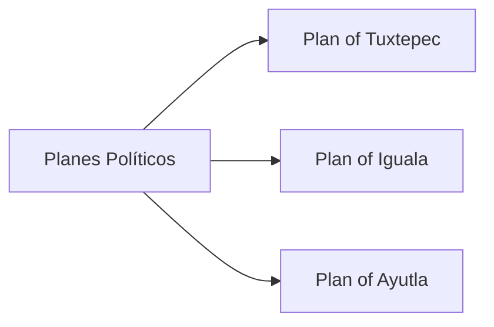

---
aliases:
tags:
  - Civilization
  - Modern
  - Vanilla
---
  

[[Cultural]], [[Diplomatic]]

>*As Mexico makes its break with the old world, it faces new challenges, both internal and external. In the Zócalo, in the stateroom, and in clandestine meetings of revolutionaries, its future is constantly being formed and re-formed, but its soul remains. Let that soul sing.*

## Unlocked
- Have three Distant Lands Settlements in Desert or Tropical
- Civilizations
	- [[Maya]]
	- [[Inca]]
	- [[Shawnee]]
	- [[Spain]]
- Leaders
	- [[Amina]]
	- [[Isabella]]
	- [[Pachacuti]]
	- [[Simón Bolívar]]
	- [[Tecumseh]]

## Unique Ability
##### *Revolución*
- Starts with a unique Government, **Revolución**
- This Government has one Celebration effect,+30% Culture for 10 Turns
- Cannot enter any other Government type

## Civic Tree
##### *Planes Políticos*
- Unlocks the **Catedral** Unique Building
- Unlocks the **Portal de Mercaderes** Unique Building
- Unlocks the **Corridos** Tradition
	- +2 Happiness in Settlements for every Tradition slotted into the Government
- Mastery
	- Gain 1 Social Policy slot
	- Unlocks the **Palacio de Bellas Artes** Wonder
##### *Plan of Tuxtepec*
- Unlock an additional Celebration effect, +30% Science for 10 Turns
- Unlocks the **Order and Progress** Tradition
	- +1 Science in Cities for every Tradition slotted into the Government
##### *Plan of Iguala*
- Unlock an additional Celebration effect, granting +40% Production towards training Military Units for 10 Turns
- Unlocks the **Cry of Dolores** Tradition
	- +1 Combat Strength for Land and Naval Units in Friendly territory for every Tradition slotted into the Government
##### *Plan of Ayutla*
- Unlock an additional Celebration effect, granting +50% Influence towards initiating all Diplomatic Actions for 10 Turns
- Unlocks the **La Reforma** Tradition
	- +1 Culture in Towns for every Tradition slotted into the Government

## Unique Military Unit
##### *Soldaderas*
- Unique Infantry Unit
- Adjacent Units heal +10 HP (does not stack)

## Unique Civilian Unit
##### *Revolucionario*
- Unique Great Person
	- **Amelio Robles Ávila**: Activate on a Zócalo to grant 2 free Soldaderas with +3 Combat Strength
	- **Vicente Guerrero**: Activated on the Palace to immediately trigger a Celebration
	- **Petra Herrera**: Activated on a Commander Unit to grant increased Combat Strength to all Soldaderas Units within its Command Radius
	- **Miguel Hidalgo**: Activate in a Town's District to summon a free Infantry Unit on every land District in that Town
	- **Ángela Jiménez**: Activated on a Commander Unit to grant Culture for every Promotion it has (effect scales based on game speed)
	- **Benito Juárez**: Activated on a Zócalo to grant an additional Tradition slot
	- **José María Morelos**: Activated on a Commander Unit to heal all Units in its Command Radius to full health
	- **Antonio López de Santa Anna**: Activated on a Commander Unit to grant it enough experience for a set number of Promotions
	- **Pancho Villa**: Activate on an Army Commander; when a Unit within this Commander's Command Radius defeats an enemy Unit, gain Gold equal to a 25% of its Combat Strength
	- **Emiliano Zapata**: Activated on a City Center to grant increased Culture to all Farms in the Settlement
- Can only be trained in Cities with a Zócalo

## Unique Infrastructure
##### *Zócalo*
- Unique Quarter
- +2 Culture for every Tradition slotted into the Government
- Unique Building: **Catedral**
	- +9 Culture
	- +1 Happiness Adjacency for Culture Buildings and Wonders
- Unique Building: **Portal de Mercaderes**
	- +9 Culture
	- +1 Gold Adjacency for Gold Buildings and Wonders

## Associated Wonder
##### *Palacio de Bellas Artes*
- +5 Culture
- Gain 1 Artifact
- Has 3 Artifact slots
- +3 Happiness on Great Works
- Must be placed adjacent to a District

## Starting Biases
- Desert
- Plains

>*A world built from the bones of the past, refashioned for a new future: Mexico has arrived.*
