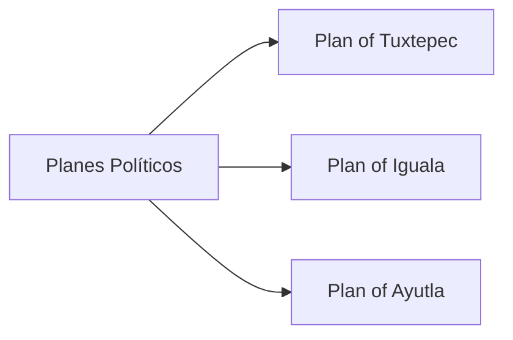

---
aliases:
tags:
  - Civilization
  - Modern
  - Vanilla
---

[[Cultural]], [[Diplomatic]]

>*As Mexico makes its break with the old world, it faces new challenges, both internal and external. In the Zócalo, in the stateroom, and in clandestine meetings of revolutionaries, its future is constantly being formed and re-formed, but its soul remains. Let that soul sing.*

## Unlocked
- Have three Distant Lands Settlements in Desert or Tropical
- Civilizations
	- [[Maya]]
	- [[Inca]]
	- [[Shawnee]]
	- [[Spain]]
- Leaders
	- [[Amina]]
	- [[Isabella]]
	- [[Pachacuti]]
	- [[Simón Bolívar]]
	- [[Tecumseh]]

## Unique Ability
##### *Revolución*
- Starts with a unique Government, **Revolución**; this Government has one Celebration effect:+30% Culture for 10 Turns; cannot enter any other Government type
- +100% Tourism from Celebrations

## Unique Infrastructure
##### Quarter: *Zócalo*
- +2 Culture for every Tradition slotted into the Government
- Building: **Catedral**
	- +9 Happiness
	- +1 Culture Adjacency for Culture Buildings and Wonders
- Building: **Portal de Mercaderes**
	- +9 Culture
	- +1 Gold Adjacency for Gold Buildings and Wonders

## Unique Units
##### Infantry Unit: *Soldaderas*
- Adjacent Units gain +10 Healing
##### Great Person: *Revolucionario*
- Can only be trained in Cities with a Zócalo
- **Amelio Robles Ávila**: Activate on a Zócalo to grant 2 free Soldaderas with +3 Combat Strength
- **Ángela Jiménez**: Activated on a Commander Unit to grant Culture for every Promotion it has (effect scales based on game speed)
- **Antonio López de Santa Anna**: Activated on a Commander Unit to grant it enough experience for a set number of Promotions
- **Benito Juárez**: Activated on a Zócalo to grant an additional Tradition slot
- **Emiliano Zapata**: Activated on a City Center to grant increased Culture to all Farms in the Settlement
- **José María Morelos**: Activated on a Commander Unit to heal all Units in its Command Radius to full health
- **Miguel Hidalgo**: Activate in a Town's District to summon a free Infantry Unit on every land District in that Town
- **Pancho Villa**: Activate on an Army Commander; when a Unit within this Commander's Command Radius defeats an enemy Unit, gain Gold equal to a 25% of its Combat Strength
- **Petra Herrera**: Activated on a Commander Unit to grant increased Combat Strength to all Soldaderas Units within its Command Radius
- **Vicente Guerrero**: Activated on the Palace to immediately trigger a Celebration

## Civics – Antiquity
##### *Origins*
- Tradition: **Order and Progress I**
	- +2 Science in Cities for every Tradition slotted into the Government
- Unlock an additional Celebration effect: +50% Growth Rate in the Capital for 10 Turns
- +1 Tradition slot
##### *Foundation*
- Attribute Traditions: [[Cultural|Enlightened Rule]] and [[Diplomatic|Priestly Class]]
- Wonder: **Pyramid of the Sun**
##### *Syncretism*
- Affirmation Tradition: **Campesinos I**
	- +2 Happiness in the Capital
	- +5 to all Yields in the Capital during a Celebration

## Civics – Exploration
##### *Renaissance*
- Tradition: **La Reforma I**
	- +1 Culture in Towns with a Growing Focus for every Tradition slotted into the Government
- Unlock an additional Celebration effect: +100% Production towards training and Gold towards purchasing Missionaries, and +2 Charges and Movement for Missionaries for 10 Turns
- +1 Tradition slot
##### *Hierarchy*
- Attribute Traditions: [[Cultural|Classical Revival]] and [[Diplomatic|Jubilee]]
- Wonder: **Notre Dame**
##### *Syncretism*
- Affirmation Tradition: **Campesinos II**
	- +4 Happiness in the Capital
	- +10 to all Yields in the Capital during a Celebration

## Civics – Modern
##### *Planes Políticos*
- Building: **Catedral**
- Building: **Portal de Mercaderes**
- Tradition: **Corridos**
	- +4 Happiness in Cities for every Tradition slotted into the Government
- Mastery
	- +1 Tradition slot
	- Wonder: **Palacio de Bellas Artes**
##### *Plan of Tuxtepec*
- Unlock an additional Celebration effect: +30% Science for 10 Turns
- Tradition: **Order and Progress II**
	- +4 Science in Cities for every Tradition slotted into the Government
##### *Plan of Iguala*
- Unlock an additional Celebration effect: +40% Production towards training Military Units for 10 Turns
- Tradition: **Cry of Dolores**
	- +1 Combat Strength for Land Units and Naval Units in Friendly territory for every Tradition slotted into the Government
##### *Plan of Ayutla*
- Unlock an additional Celebration effect: +50% Influence towards initiating all Diplomatic Actions for 10 Turns
- Tradition: **La Reforma II**
	- +1 Culture in Towns for every Tradition slotted into the Government

## Associated Wonder
##### *Palacio de Bellas Artes*
- Unlocked for any Civilization by the *Globalism II* Civic
- +5 Culture
- Gain 1 Artifact
- Has 3 Great Work slots
- +3 Happiness on Great Works
- Must be placed adjacent to a District

## Starting Biases
- Desert
- Plains

.jpg/revision/latest)

>*A world built from the bones of the past, refashioned for a new future: Mexico has arrived.*

