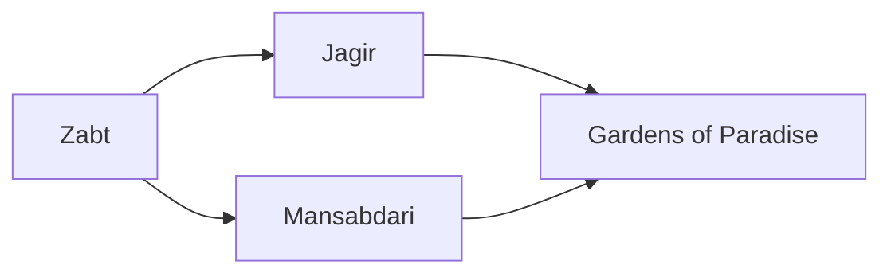

---
tags:
  - Civilization
  - Modern
  - Vanilla
---
  

[[Economic]], [[Expansionist]]

>*From the Peacock Throne, the Mughals oversee lands sprawling and rich, decadent and earnest, where architects dream of wonders and commoners dream of bread. Its contrasts are yours – give the order.*

## Unlocked
- Have at least three Trade Routes with unique Civilizations
- Civilizations
	- [[Achaemenid Persia]]
	- [[Abbasid]]
	- [[Chola]]
- Leaders
	- [[Ashoka, World Conqueror]]
	- [[Ashoka, World Renouncer]]
	- [[Genghis Khan]]
	- [[Hatshepsut]]
	- [[Ibn Battuta]]
	- [[Lakshmibai]]
	- [[Sayyida al Hurra]]
	- [[Xerxes, the Achaemenid]]
	- [[Xerxes, King of Kings]]

## Unique Ability
##### *Paradise of Nations*
- +100% Gold Yields
- -25% to all other yields except Food
- You can purchase Wonders with Gold, but they are 150% more expensive

## Unique Infrastructure
##### Improvement: *Stepwell*
- +2 Food
- +2 Food from adjacent Farms
- Must be placed on Flat Terrain
- Cannot be placed adjacent to another Stepwell

## Unique Units
##### Infantry Unit: *Sepoy*
- Can make a Ranged Bombard attack
##### Settler: *Zamindar*
- +1 Population on new Towns

## Civics – Antiquity
##### *Origins*
- Tradition: **Qilachas I**
	- +1 Gold on Fortified Districts
- +1 Settlement Limit
- +1 Tradition slot
##### *Foundation*
- Attribute Traditions: [[Economic|Merchant Class]] and [[Expansionist|Fractal Cities]]
- +1 Settlement Limit
##### *Syncretism*
- Affirmation Tradition: **Karkhanas I**
	- +1 Gold on Farms in Towns

## Civics – Exploration
##### *Renaissance*
- Tradition: **Mayūrāsana I**
	- +5% Gold towards purchasing Units, Improvements, Buildings, and Wonders
- +1 Settlement Limit
- +1 Tradition slot
##### *Hierarchy*
- Attribute Traditions: [[Economic|Supply and Demand]] and [[Expansionist|Yanakuna]]
- +1 Settlement Limit
##### *Syncretism*
- Affirmation Tradition: **Karkhanas II**
	- +2 Gold on Farms in Towns

## Civics – Modern
##### *Zabt*
- Improvement: **Stepwell**
- Tradition: **Jins-i Kamil**
	- +1 Food on Farms for each adjacent Plantation, and on Plantations for each adjacent Farm
- +1 Tradition slot
##### *Jagir*
- Tradition: **Qilachas II**
	- +2 Gold on Fortified Districts
- +1 Settlement Limit
##### *Mansabdari*
- Tradition: **Gunpowder Empire**
	- +3 Combat Strength for all Units
- Wonder: **Red Fort**
##### *Gardens of Paradise*
- Tradition: **Mayūrāsana II**
	- +10% Gold towards purchasing Units, Improvements, Buildings, and Wonders
- +1 Tradition slot

## Associated Wonder
##### *Red Fort*
- Unlocked for any Civilization by the *Military Science* Technology
- +4 Gold
- +4 Production
- Acts as a Fortified District that must be conquered
- +50 HP to this tile and all City Centers
- Must be adjacent to a District

## Starting Bias
- Flat

>*The Mughals come, foreigners to the land, but with a drive to assemble the foundations of an empire from the detritus of what went before.*
