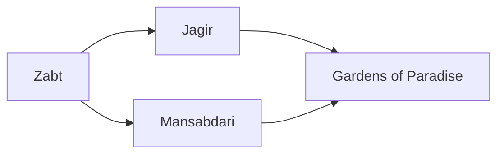

---
tags:
  - Civilization
  - Modern
  - Vanilla
---
  

[[Economic]], [[Expansionist]]

>*From the Peacock Throne, the Mughals oversee lands spraling and rich, decadent and earnest, where architects dream of wonders and commoners dream of bread. Its contrasts are yours – give the order.*

## Unlocked
- Have at least three Trade Routes with unique Civilizations
- Civilizations
	- [[Achaemenid Persia]]
	- [[Abbasid]]
	- [[Chola]]
- Leaders
	- [[Ashoka, World Renouncer|Ashoka]]
	- [[Genghis Khan]]
	- [[Hatshepsut]]
	- [[Ibn Battuta]]
	- [[Lakshmibai]]
	- [[Sayyida al Hurra]]
	- [[Xerxes, King of Kings|Xerxes]]

## Unique Ability
##### *Paradise of Nations*
- +100% Gold Yields
- -25% to all other yields

## Unique Infrastructure
##### Improvement: *Stepwell*
- +2 Food
- +2 Food from adjacent Farms
- Must be placed on Flat Terrain
- Cannot be placed adjacent to another Stepwell Improvement

## Unique Units
##### Infantry Unit: *Sepoy*
- Can make a Bombard Ranged attack
##### Settler: *Zamindar*
- +1 Population on new Settlements

## Civics – Antiquity
##### *Origins*
- Tradition: ****
	- 
- 
##### *Foundation*
- Attribute Traditions: 
- 
##### *Syncretism*
- Affirmation Tradition: ****
	- 

## Civics – Exploration
##### *Renaissance*
- Tradition: ****
	- 
- 
##### *Hierarchy*
- Attribute Traditions: 
- 
##### *Syncretism*
- Affirmation Tradition: ****
	- 

## Civics – Modern
##### *Zabt*
- +1 Gold on Farms in Towns
- Unlocks the **Jins-i Kamil** Tradition
	- +1 Food on Farms for each adjacent Plantation, and on Plantations for each adjacent Farm
- Unlocks the **Stepwell** Improvement
##### *Jagir*
- +1 Happiness on Farms
- Unlocks the **Qilachas** Tradition
	- +2 Gold on Fortified Quarters
- +1 Settlement Limit
##### *Mansabdari*
- +25% Gold towards purchasing Infantry Units
- Unlocks **Gunpowder Empire** Tradition
	- +3 Combat Strength for all Units
- Unlocks the **Red Fort** Wonder
##### *Gardens of Paradise*
- You can purchase Wonders with Gold
- Unlocks the **Mayūrāsana** Tradition
	- +10% Gold towards purchasing anything

## Associated Wonder
##### *Red Fort*
- +4 Gold
- +4 Production
- Acts as a Fortified District that must be conquered
- +50 HP to this tile and all City Centers
- Must be built adjacent to a District

## Starting Bias
- Flat

>*The Mughals come, foreigners to the land, but with a drive to assemble the foundations of an empire from the detritus of what went before.*
