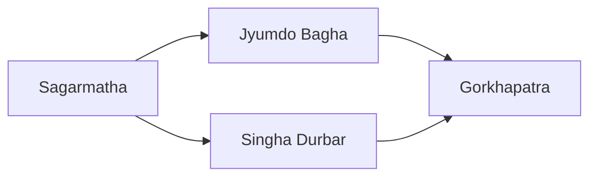

---
aliases:
tags:
  - Civilization
  - Modern
  - DLC
---
*Available with the Nepal Pack DLC*
*Included in the [[Crossroads of the World Collection]]*

  

[[Cultural]], [[Diplomatic]]

>*Nepal never submits. From their high fortresses, the gurkhas watch vigilantly, and in the Durbar Square ministers plan and plot. Under the Nepali flag, the highest peaks become prosperous, and far below the brick stupas and spires, let Nepal's enemies tire themselves on the slopes.*

## Unlocked
- Have 3 Settlements with at least 5 Mountains
- Civilizations
	- [[Maurya]]
	- [[Chola]]
- Leaders
	- [[Ashoka, World Renouncer|Ashoka]]
	- [[Lakshmibai]]
	- [[Pachacuti]]

## Unique Ability
##### *Roof of the World*
- All Warehouse buildings apply to Mountain Terrain tiles, but they cost +1 Gold and Happiness Maintenance

## Civic Tree
##### *Sagarmatha*
- Food and Science Buildings receive an adjacency from Mountains
- Mastery
	- Sherpas can activate on an unowned Mountain tile within 5 tiles of one of your Settlements' Palace or City Hall; a path of tiles is claimed back to the Settlement and the Mountain tile is improved immediately with a Highland Power Station
##### *Jyumdo Bagha*
- All Districts adjacent to Mountains receive Defensive Fortifications, one-time effect; follows normal Walls placement rules
- Mastery
	- Unlocks the **Tundikhel** Tradition
		- +3 Combat Strength for all Units adjacent to Mountain terrain; this is doubled if the Unit is also in your territory
	- Units complete Fortifications in 1 turn if adjacent to a Mountain
##### *Singha Durbar*
- Unlocks the **Gift Gurkha** Action, which grants a Gurkha to another Civilization; Nepal receives a +10 Relationship with them and 5 (Scales by Gamespeed) Culture for the current Relationship Level with them; can only be done with Friendly or Helpful Civilizations
- Unlocks the **Boudhanath** Wonder
- Mastery
	- +3 Influence on Culture Buildings
	- Unlocks the **Maitri Sanadhi** Tradition
		- +50% Influence towards initiating Endeavors if you have the least amount of Settlements, +20% otherwise
##### *Gorkhapatra*
- Museums have 2 additional Great Work Slots
- Unlocks the **Himāl** Tradition
	- Mountain tiles receive +4 Culture in your Capital
	- Mountain tiles receive +2 Culture in other Settlements

## Unique Military Unit
##### *Gurkha*
- Unique Infantry Unit
- Stronger, faster, and more expensive

## Unique Civilian Unit
##### *Sherpa*
- Unique Scout
- Ignores Mountains and Rough Terrain for Sight
- Ignores Mountains for Movement

## Unique Infrastructure
##### *Highland Power Station*
- Unique Improvement
- +3 Production and +3 Culture
- Must be built on Mountain terrain and is constructed by the Sherpa

## Associated Wonder
##### *Boudhanath*
- +6 Influence
- Increase your Relationship with all other Leaders by 20
- Must be built in Grassland or Tropical adjacent to a Mountain

## Starting Bias
- Mountains

>*Nepal rises above its neighbors, looking to become a world power.*
