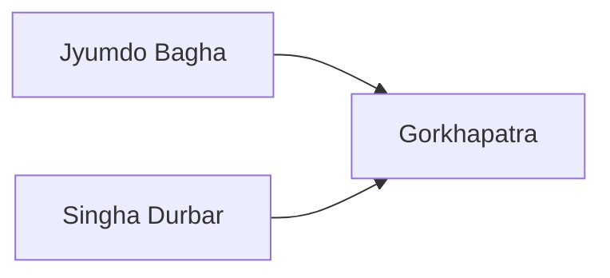

---
aliases:
tags:
  - Civilization
  - Modern
  - DLC
---
*Available with the Nepal Pack DLC*
*Included in the [[Crossroads of the World Collection]]*

[[Diplomatic]], [[Cultural]]

>*Nepal never submits. From their high fortresses, the Gurkhas watch vigilantly, and in the Durbar Square ministers plan and plot. Under the Nepali flag, the highest peaks become prosperous, and far below the brick stupas and spires, let Nepal's enemies tire themselves on the slopes.*

## Unique Ability
##### *Roof of the World*
- Can work Mountain Terrain
- All Warehouse buildings apply to Mountain Terrain tiles, but they cost +1 Gold and Happiness Maintenance
- [Mod] +1 Tourism from Unique Improvements on Mountains

## Unique Infrastructure
##### Improvement: *Highland Power Station*
- +3 Production and +3 Culture
- Must be placed on a featureless Mountain Terrain and is constructed by the Sherpa

## Unique Units
##### Infantry Unit: *Gurkha*
- Stronger, faster, and more expensive
##### Scout: *Sherpa*
- Ignores Mountains and Rough Terrain for Sight
- Ignores featureless Mountains for Movement
- Can move on Mount Everest
- Can Claim Mountains within 5 tiles of one of your Settlements

## Civics – Antiquity
##### *Origins*
- Tradition: **Himāl I**
	- +2 Culture on Mountain Terrain in your Capital
	- +1 Culture on Mountain Terrain in other Settlements
- +1 Tradition slot
##### *Foundation*
- Attribute Traditions: [[Cultural|Enlightened Rule]] and [[Diplomatic|Emissaries]] 
- Wonder: **Pyramid of the Sun**
##### *Syncretism*
- Affirmation Tradition: **Kumar and Kumari I**
	- +1 Culture on Warehouse Buildings
	- +1 Influence on Mountains

## Civics – Exploration
##### *Renaissance*
- Tradition: **Maitri Sanadhi I**
	- +25% Influence towards initiating Endeavors if you have the least amount of Settlements, +10% otherwise
- +1 Tradition slot
##### *Hierarchy*
- Attribute Traditions: [[Cultural|Classical Revival]] and [[Diplomatic|Spy Network]]
- Wonder: **Notre Dame**
##### *Syncretism*
- Affirmation Tradition: **Kumar and Kumari II**
	- +2 Culture on Warehouse Buildings
	- +1 Influence on Mountains

## Civics – Modern
##### *Jyumdo Bagha*
- Tradition: **Tundikhel**
	- +3 Combat Strength for all Units adjacent to Mountains; this is doubled if the Unit is also in your territory
	- Units complete Fortifications in 1 turn if adjacent to a Mountain
- +1 Tradition slot
##### *Singha Durbar*
- Wonder: **Boudhanath**
- Unlocks the Gift Gurkha Action, which grants a Gurkha Unit to another Civilization; Nepal receives a +10 Relationship with them and 5 Culture (Scales by Gamespeed) for the current Relationship Level with them; can only be done with Friendly or Helpful Civilizations
- Tradition: **Maitri Sanadhi II**
	- +50% Influence towards initiating Endeavors if you have the least amount of Settlements, +20% otherwise
##### *Gorkhapatra*
- Tradition: **Himāl II**
	- +4 Culture on Mountain Terrain in your Capital
	- +2 Culture on Mountain Terrain in other Settlements
- Tradition: **Sagarmatha**
	- Food and Science Buildings receive an Adjacency from Mountains
- +1 Tradition slot

## Associated Wonder
##### *Boudhanath*
- Unlocked for any Civilization by the *Nationalism* Civic
- +6 Influence
- Increase your Relationship with all other Leaders by 20
- Must be built in Grassland or Tropical adjacent to a Mountain

## Age Unlocks
*(available for and grants access to the below for Syncretism and Age Transition)*
- Antiquity
	- [[Heian Japan]]
	- [[Maurya]]
- Exploration
	- [[Chola]]
- Leaders
	- [[Ashoka, World Conqueror]]
	- [[Ashoka, World Renouncer]]
	- [[Lakshmibai]]
	- [[Pachacuti]]

## Secondary Unlock
- Have 3 Settlements with at least 5 Mountains

## Starting Bias
- Mountains

.jpg/revision/latest)

>*Nepal rises above its neighbors, looking to become a world power.*

