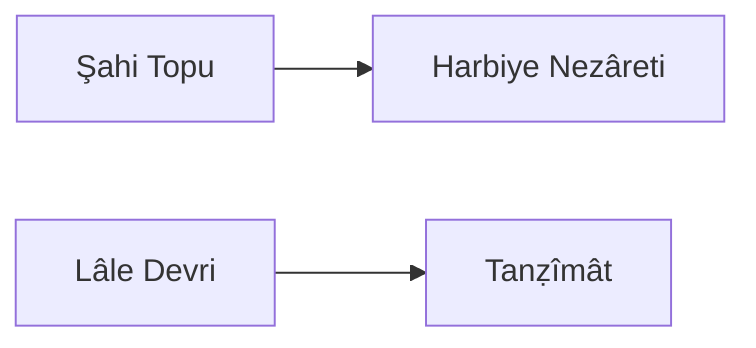

---
tags:
  - Civilization
  - Modern
  - DLC
aliases:
---
*Available with the Ottomans Pack DLC*
*Included in the [[Tides of Power Collection]]*

  

[[Cultural]], [[Militaristic]]

>*Amid sparkling minarets and bright tulip gardens, the Ottomans reign at the world's crossroads. Cannons boom over land and sea, and bazaars burst with global goods. The empire's tradition holds strong in the külliye while secular reforms gain traction in the coffeehouse. Now take up the Sword of Osman and decide the empire's fate.*

## Unlocked
- Conquer a Capital
- Civilizations
	- [[Carthage]]
	- [[Egypt]]
	- [[Rome]]
	- [[Abbasid]]
- Leaders
	- [[Alexander the Great]]
	- [[Gilgamesh]]
	- [[Ibn Battuta]]
	- [[Sayyida al Hurra]]

## Unique Ability
##### *Devlet-i 'Aliye-i 'Osmâniye*
- [Ant/Exp] Gain a Codex/Relic when you enter a Celebration, or conquer an Original Capital for the first time
- [Mod] When any Leader Excavates an Artifact in the Ottomans' territory, they generate an additional Artifact
- +3 Combat Strength for Infantry and Siege Units when attacking

## Unique Infrastructure
##### Quarter: *Külliye*
- +3 Culture and +2 Gold on Specialists in this City
- Unique Building: **Cami**
	- +9 Culture
	- +1 Happiness Adjacency with Science Buildings
	- +1 Culture Adjacency with Wonders
	- Has 2 Artifact slots
- Unique Building: **Hammam**
	- +9 Happiness
	- +1 Gold Adjacency with Cultural Buildings
	- +1 Happiness Adjacency with Wonders

## Unique Units
##### Infantry Unit: *Janissary*
- +5 Combat Strength against other Land Units
- All Civilizations' Settlements suffer a -2 Happiness penalty for every Janissary stationed in or occupying a District
##### Light Naval Unit: *Barbary Corsair*
- It costs no Movement to Coastal Raid

## Civics – Antiquity
##### *Origins*
- Tradition: **Sedef Kakma I**
	- +3 Culture on Quarters with at least 1 Happiness Building
	- +3 Happiness on Quarters with at least 1 Culture Building
- +1 Tradition slot
- +1 Settlement Limit
##### *Foundation*
- Attribute Traditions: [[Cultural|Enlightened Rule]] and [[Militaristic|Warrior Class]]
- Wonder: **Pyramid of the Sun**
- +1 Settlement Limit
##### *Syncretism*
- Affirmation Tradition: **Mehterân I**
	- +5 Combat Strength for Siege Units
	- +1 Movement for Siege and Support Units

## Civics – Exploration
##### *Renaissance*
- Tradition: **Osmanlı Barok I**
	- +2 Happiness from displayed Great Works
- +1 Tradition slot
- +1 Settlement Limit
##### *Hierarchy*
- Attribute Traditions: [[Cultural|Classical Revival]] and [[Militaristic|Professional Army]]
- Wonder: **Notre Dame**
- +1 Settlement Limit
##### *Syncretism*
- Affirmation Tradition: **Mehterân II**
	- +5 Combat Strength for Siege Units
	- +1 Movement for Siege and Support Units
	- Training a Siege Unit grants Happiness towards Celebrations equal to 50% of the Unit's Production cost

## Civics – Modern
##### *Şahi Topu*
- Tradition: **Siege Train**
	- When a unit destroys a Fortified District's defenses, all other Land Siege and Infantry Units have their Movement restored
- +1 Settlement Limit
##### *Harbiye Nezâreti*
- Tradition: **Erkân-ı Harbiye Mektebi**
	- +25% Production towards training Siege and Infantry Units
	- -2 Gold Maintenance for Land Units
- +1 Settlement Limit
##### *Lâle Devri*
- Tradition: **Sedef Kakma II**
	- +5 Culture on Quarters with at least 1 Happiness Building
	- +5 Happiness on Quarters with at least 1 Culture Building
- Building: **Hammam**
- Wonder: **Sultanahmet Camii**
- Mastery
	- Building: **Cami**
	- +2 Tradition slots
##### *Tanẓîmât*
- Tradition: **Osmanlı Barok II**
	- +3 Happiness from displayed Great Works
	- +15% Production towards constructing Museums
- Gain 1 Artifact

## Associated Wonder
##### *Sultanahmet Camii*
- +4 Happiness
- +2 Culture and Gold on Wonders in this Settlement; this is doubled for Exploration Wonders and tripled for Antiquity Wonders
- Must be built adjacent to another Wonder

