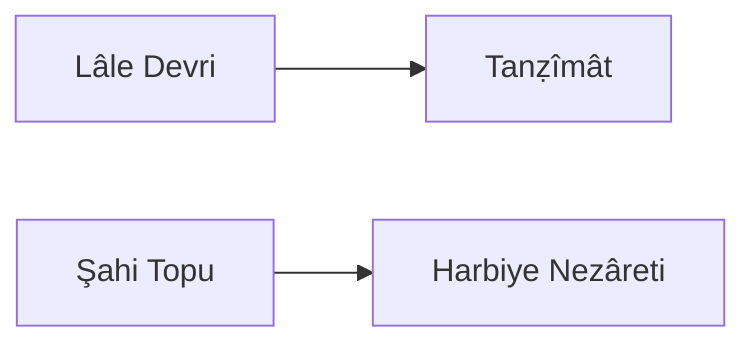

---
tags:
  - Civilization
  - Modern
  - DLC
aliases:
---
*Available with the Ottomans Pack DLC*
*Included in the [[Tides of Power Collection]]*

  

[[Militaristic]], [[Cultural]]

>*Amid sparkling minarets and bright tulip gardens, the Ottomans reign at the world's crossroads. Cannons boom over land and sea, and bazaars burst with global goods. The empire's tradition holds strong in the külliye while secular reforms gain traction in the coffeehouse. Now take up the Sword of Osman and decide the empire's fate.*

## Unlocked
- Conquer a Capital
- Civilizations
	- [[Carthage]]
	- [[Egypt]]
	- [[Rome]]
	- [[Abbasid]]
- Leaders
	- [[Alexander the Great]]
	- [[Gilgamesh]]
	- [[Ibn Battuta]]
	- [[Sayyida al Hurra]]

## Unique Ability
##### *Devlet-i 'Aliye-i 'Osmâniye*
- When any Leader Excavates an Artifact in the Ottomans' territory, they generate an additional Artifact
- +3 Combat Strength for Infantry and Siege Units when attacking

## Civic Tree
##### *Lâle Devri*
- Unlocks the **Sedef Kakma** Tradition
	- +3 Culture on Quarters with at least 1 Happiness Building
	- +3 Happiness on Quarters with at least 1 Culture Building
- Unlocks the **Hammam** Building
- Unlocks the **Sultanahmet Camii** Wonder
- Mastery
	- Unlocks the **Cami** Unique Building
	- +1 Social Policy slot
##### *Tanẓîmât*
- Unlocks the **Osmanlı Barok** Tradition
	- +3 Happiness from displayed Great Works
- +15% Production towards constructing Museums
- Mastery
	- Gain 1 Artifact
	- Explorers ignore Vegetated Terrain and Rivers for Movement
##### *Şahi Topu*
- Unlocks the **Siege Train** Tradition
	- When a unit destroys a Fortified District's defenses, all other Land Siege and Infantry Units have their Movement restored
- Army Commanders gain the Barrage Promotion for free
- Mastery
	- +1 Settlement Limit
	- +5 Combat Strength for Infantry units against Fortified Districts
##### *Harbiye Nezâreti*
- +15% Production towards training Siege and Infantry Units
- +2 Gold Maintenance on Land units
- Mastery
	- Unlocks the **Erkân-ı Harbiye Mektebi** Tradition
		- Land Military Units fight as though they were at full Combat Strength even when damaged
	- +1 Settlement Limit

## Unique Military Units
##### *Janissary*
- Unique Infantry
- +5 Combat Strength against other Land Units
- All Civilizations' Settlements suffer a -2 Happiness penalty for every Janissary stationed in or occupying a District
##### *Barbary Corsair*
- Unique Light Naval Unit
- It costs no Movement to Coastal Raid

## Unique Infrastructure
##### *Külliye*
- Unique Quarter
- +3 Culture and +2 Gold on Specialists in this City
- Unique Building: **Cami**
	- +9 Culture
	- +1 Happiness Adjacency with Science Buildings
	- +1 Culture Adjacency with Wonders
	- Has 2 Artifact slots
- Unique Building: **Hammam**
	- +9 Happiness
	- +1 Gold Adjacency with Cultural Buildings
	- +1 Happiness Adjacency with Wonders

## Associated Wonder
##### *Sultanahmet Camii*
- +4 Happiness
- +2 Culture and Gold on Wonders in this Settlement
- This is doubled for Exploration Wonders and tripled for Antiquity Wonders
- Must be built adjacent to another Wonder

