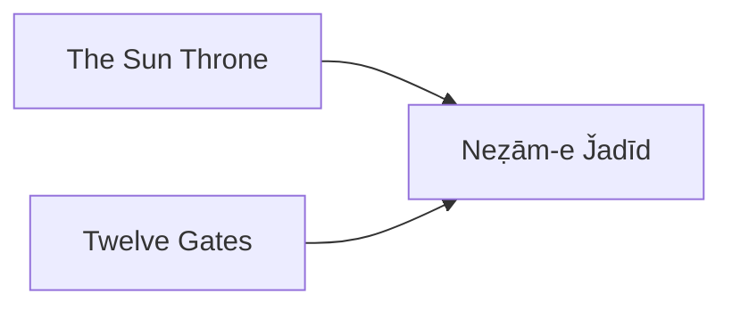

---
tags:
  - Civilization
  - DLC
  - Modern
---
*Available with the Qajar Pack DLC*
*Included in the [[Right to Rule Collection]]*

  

[[Diplomatic]], [[Expansionist]]

>*The Guarded Domains of Iran are known for the dynasty that rules them – Qajar. Defying the great powers of the world, Qajar Iran remains, building a legacy of art and architecture that places a Persian stamp upon modernity. Rule by beauty or the rifle, but carve for Qajar its place upon the world.*

## Unlocked
- Have 1 Settlement with at least 5 Specialists
- Civilizations
	- [[Achaemenid Persia]]
	- [[Assyria]]
- Leaders
	- [[Gilgamesh]]
	- [[Xerxes, King of Kings|Xerxes]]

## Unique Ability
##### *Kayānī Crown*
- +50% Influence toward Supporting Diplomatic Actions

## Unique Infrastructure
##### Quarter: *Bāq*
- +10% Culture and Influence in this Settlement when in a Celebration
- Building: **Ghahve Khaneh**
	- +9 Food
	- +1 Happiness Adjacency for Gold Buildings and Wonders
- Building: **Takyeh**
	- +9 Happiness
	- +1 Influence Adjacency for Culture Buildings and Wonders

## Unique Units
##### Cavalry Unit: *Gholām*
- Has +1 Movement
- +5 Combat Strength and +10 HP healing in the Command Radius of a Sardār Commander
##### Army Commander: *Sardār*
- +1 Movement
- While razing a Settlement, an additional Districts is Razed per turn in Settlements where this Commander is on a District

## Civics – Antiquity
##### *Origins*
- Tradition: ****
	- 
- 
##### *Foundation*
- Attribute Traditions: 
- 
##### *Syncretism*
- Affirmation Tradition: ****
	- 

## Civics – Exploration
##### *Renaissance*
- Tradition: ****
	- 
- 
##### *Hierarchy*
- Attribute Traditions: 
- 
##### *Syncretism*
- Affirmation Tradition: ****
	- 

## Civics – Modern
##### *The Sun Throne*
- Unlocks the **Takyeh** Unique Building
- Unlocks the **Soleymaniyeh Palace** Tradition
	- +0.5 Influence for every Population in the Capital
- Unlocks the **Eram Garden** Wonder
- Mastery
	- When you Support an Endeavor receive 200 Culture and the other leader receives 100 Gold (on Standard Speed)
##### *Twelve Gates*
- Unlocks the **Ghahve Khane** Unique Building
- Unlocks the **Waqāyeʿ-e Ettefāqiya** Tradition
	- +10 Science and Culture in the Capital for every Settlement under the Settlement Limit
- Mastery
	- +10 Food and Production in the Capital for every Settlement under the Settlement Limit
##### *Neẓām-e J̌adīd*
- +1 Combat Strength for every 2 Settlements under the Settlement Limit to Land Combat Units
- Unlocks the **Qullarāqāsi** Tradition
	- Commanders Stationed on a District provide +15 Happiness

## Associated Wonder
##### *Eram Garden*
- +4 Food
- +1 Specialist Limit in this City
- Must be built in Desert Terrain

## Starting Biases
- Plains
- Desert

