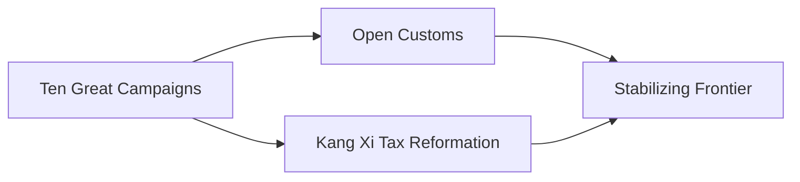

---
tags:
  - Civilization
  - Modern
  - Vanilla
---

[[Economic]], [[Expansionist]]

>*From the northern edges of the Chinese world come the Manchu, the Qing Dynasty of China. The mandarins of the court administer vast territories, their artists produce marvels that are the envy of the world, and their gusa defend the land against all who would seek to claim their mandate. Let the world remember the Qing.*

## Unique Ability
##### *Kang Qian Shengshi*
- +1/+2/+3 Gold and Culture for every imported Resource, but -2/-4/-6 Science per Trade Route
- [Mod] +1 GDP per turn for imported Resources assigned to Cities
- +1 Combat Strength for Land Units for every other Civilization you have a Trade Route with

## Unique Infrastructure
##### Quarter: *Huiguan*
- +25% Influence in this Settlement
- Building: **Shiguan**
	- +9 Science
	- +1 Happiness Adjacency for Happiness Buildings and Wonders
- Building: **Qianzhuang**
	- +9 Gold
	- +1 Gold Adjacency for Gold Buildings and Wonders

## Unique Units
##### Infantry Unit: *Gusa*
- +4 Combat Strength if adjacent to another Gusa
##### Merchant: *Hangshang*
- Gain 50 Gold for every Resource acquired when creating a Naval Trade Route

## Civics – Antiquity
##### *Origins*
- Tradition: **Tun Ken I**
	- +25% Growth Rate in Towns with a Resource assigned to them
- Unlocks Merchants
- Gain a free Merchant
- +1 Settlement Limit
- +1 Tradition slot
##### *Foundation*
- Attribute Traditions: [[Economic|Merchant Class]] and [[Expansionist|Fractal Cities]]
- +1 Settlement Limit
##### *Syncretism*
- Affirmation Tradition: **Ethnic Stratification I**
	- +2 Resource Capacity in the Capital

## Civics – Exploration
##### *Renaissance*
- Tradition: **Cohong I**
	- +1 Influence in the Capital for every 2 Resources assigned to it
- +1 Tradition slot
- Mastery
	- Tradition: **Banner Army I**
		- +20% Production towards training Land Units
		- -1 Gold Maintenance for Land Units
	- +1 Settlement Limit
##### *Hierarchy*
- Attribute Traditions: [[Economic|Supply and Demand]] and [[Expansionist|Yanakuna]]
- +1 Settlement Limit
##### *Syncretism*
- Affirmation Tradition: **Ethnic Stratification II**
	- +2 Resource Capacity in Cities founded by you

## Civics – Modern
##### *Ten Great Campaigns*
- Tradition: **Tun Ken II**
	- +50% Growth Rate in Towns with a Resource assigned to them
- +1 Settlement Limit
##### *Open Customs*
- Building: **Qianzhuang**
- Tradition: **Cohong II**
	- +1 Influence in Cities for every 2 Resources assigned to them
- +1 Settlement Limit
##### *Kang Xi Tax Reformation*
- Building: **Shiguan**
- Tradition: **Farmland Assessment**
	- +2 Food in Cities for each Resource assigned to them
- +1 Tradition slot
##### *Stabilizing Frontier*
- +2 Happiness from Resources assigned to Cities
- Tradition: **Banner Army II**
	- +30% Production towards training Land Units
	- -2 Gold Maintenance for Land Units
- Wonder: **Chengde Mountain Resort**

## Associated Wonder
##### *Chengde Mountain Resort*
- Unlocked for any Civilization by the *Hegemony II* Civic
- +6 Gold
- +5% Culture for every other Civilization with which you have a Trade Route
- Must be built adjacent to a Mountain

## Age Unlocks
*(available for and grants access to the below for Syncretism and Age Transition)*
- Antiquity
	- [[Han]]
- Exploration
	- [[Ming]]
	- [[Mongolia]]
- Leaders
	- [[Confucius]]

## Secondary Unlock
- Improve three Jade

## Starting Bias
- Grassland

.jpg/revision/latest)

>*The Eight Banners rise to make way for the Qing.*

