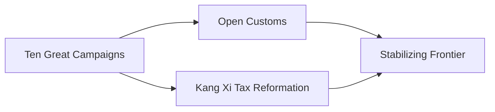

---
tags:
  - Civilization
  - Modern
  - Vanilla
---
  

[[Economic]], [[Expansionist]]

>*From the northern edges of the Chinese world come the Manchu, the Qing Dynasty of China. The mandarins of the court administer vast territories, their artists produce marvels that are the envy of the world, and their gusa defend the land against all who would seek to claim their mandate. Let the world remember the Qing.*

## Unlocked
- Improve three Jade
- Civilizations
	- [[Han]]
	- [[Ming]]
	- [[Mongolia]]
- Leaders
	- [[Confucius]]

## Unique Ability
##### *Kang Qian Shengshi*
- +4 Gold, +4 Culture, +2 Influence, but -4 Science per Trade Route

## Unique Infrastructure
##### Quarter: *Huiguan*
- +25% Influence in this Settlement
- Building: **Shiguan**
	- +9 Science
	- +1 Happiness Adjacency for Happiness Buildings and Wonders
- Building: **Qianzhuang**
	- +9 Gold
	- +1 Gold Adjacency for Gold Buildings and Wonders

## Unique Units
##### Infantry Unit: *Gusa*
- +4 Combat Strength if adjacent to another Gusa Unit
##### Merchant: *Hangshang*
- Gain 50 Gold for every Resource acquired when creating a naval Trade Route

## Civics – Antiquity
##### *Origins*
- Tradition: ****
	- 
- 
##### *Foundation*
- Attribute Traditions: 
- 
##### *Syncretism*
- Affirmation Tradition: ****
	- 

## Civics – Exploration
##### *Renaissance*
- Tradition: ****
	- 
- 
##### *Hierarchy*
- Attribute Traditions: 
- 
##### *Syncretism*
- Affirmation Tradition: ****
	- 

## Civics – Modern
##### *Ten Great Campaigns*
- +1 Combat Strength for all Units for every Civilization and City-State you have a Trade Route with
- Unlocks the **Chuang Guandong** Tradition
	- +25% Growth Rate in Towns with a Resource assigned to them
##### *Open Customs*
- Unlocks the **Qianzhuang** Unique Building
- +1 Culture from imported Resources
- Unlocks the **Cohong** Tradition
	- +50% Trade Income
- +1 Settlement Limit
##### *Kang Xi Tax Reformation*
- Unlocks the **Shiguan** Unique Building
- +2 Food from Resources assigned to Cities
- Unlocks the **Farmland Assessment** Tradition
	- +5% Production towards training Land Units
##### *Stabilizing Frontier*
- +2 Happiness from Resources assigned to Cities
- Unlocks the **Banner Army** Tradition
	- +3 Combat Strength for all Units against Land Units
- Unlocks the **Chengde Mountain Resort** Wonder

## Associated Wonder
##### *Chengde Mountain Resort*
- +6 Gold
- +5% Culture for every other Civilization with which you have a Trade Route
- Must be built adjacent to a Mountain

## Starting Bias
- Grassland

>*The Eight Banners rise to make way for the Qing.*
