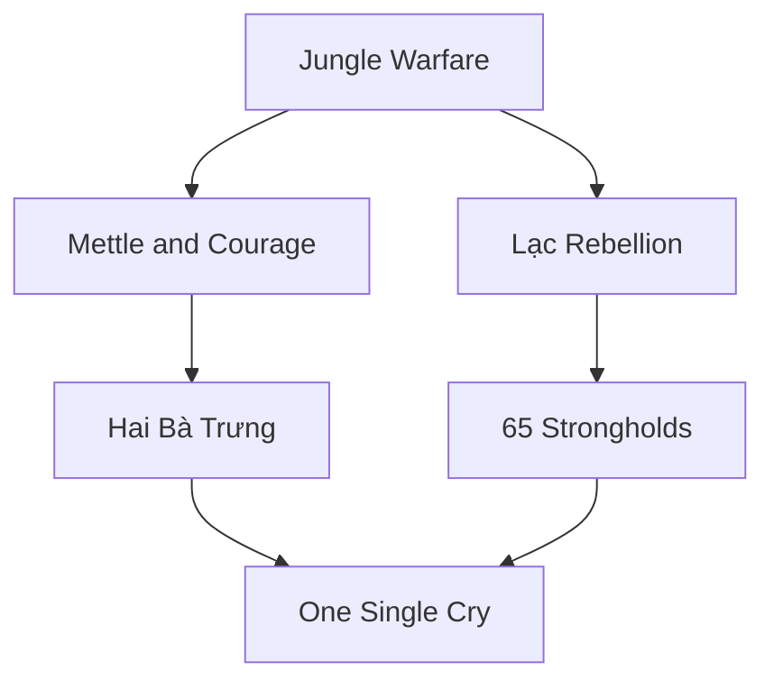

---
tags:
  - Commander
---
  

- Unique Army Commander available to [[Trung Trac]]
- Respawns faster than other Commanders when defeated
- Starts with the Heroic Assault Command
- Gains access to the Unique **Sisters Unite** Commendation, replacing *Duty*
	- +30 Damage for Heroic Assault
- Gains access to the Unique **Trung Nhi** Promotion Tree, replacing *Zeal*
	- **Jungle Warfare**: +5 Combat Strength for Land Units in Tropical Terrain in the Command Radius; +3 Damage for Heroic Assault
	- **Mettle and Courage**: +5 Combat Strength for Land Units in the Command Radius when in friendly territory; +3 Damage for Heroic Assault
	- **Lạc Rebellion**: +3 Combat Strength for Land Units in the Command Radius when there are at least 2 adjacent enemy Units; +3 Damage for Heroic Assault
	- **Hai Bà Trưng**: +15 Combat Strength for this Commander when defending; + 3 Damage for Heroic Assault
	- **65 Strongholds**: +5 Combat Strength against Fortified Districts for Land Units in the Command Radius; +3 Damage for Heroic Assault
	- **One Single Cry**: +5 Combat Strength with Coordinated Attack and Focus Fire; +10 Damage for Heroic Assault

